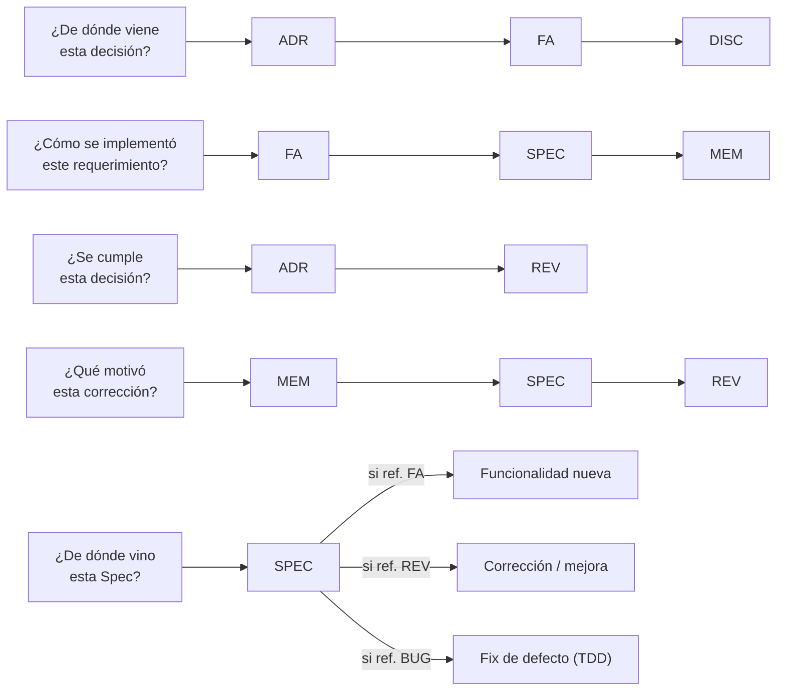
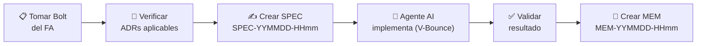

# Avenga AI-Native-SDLC Dev Flow

## Propósito

Esta carpeta centraliza **toda** la documentación técnica y funcional del proyecto,
organizada en subcarpetas temáticas que cubren el ciclo de vida completo del
desarrollo de software: desde la investigación inicial hasta la memoria de lo
implementado.

**Principio rector:** *Documentation as Code* — la documentación viaja con el
código en el mismo repositorio, se versiona con Git, es accesible para todo el
equipo (incluidos los agentes AI de desarrollo), y se mantiene actualizada como
parte del flujo de trabajo normal.

---

## Estructura de Carpetas

```
devflow/
├── input/          Material crudo de entrada (legacy, esquemas, grabaciones)
├── analysis/       Análisis de dominio (entrevistas, domain-model, procesos BPMN)
├── avenga-sdlc/    Metodología de desarrollo (SDLC)
├── discovery/      Investigación y hallazgos iniciales
├── functional/     Análisis funcional (user stories, bolts, reglas de negocio)
├── adrs/           Decisiones arquitectónicas (Architecture Decision Records)
├── spec/           Especificaciones de implementación (Spec-Kits)
├── reviews/        Revisiones de código y arquitectura
├── bugs/           Defectos confirmados con causa raíz
├── risks/          Registro de riesgos del proyecto
├── other-docs/     Documentación externa de terceros
├── memory/         Memoria del proyecto (registro de lo implementado)
├── ONBOARDING.md   Guía de onboarding para nuevos integrantes
└── CHANGELOG.md    Registro de cambios al propio framework
```

Cada subcarpeta tiene su propio **README.md** (guía de uso). Leer el README antes de
crear documentos nuevos. Las carpetas `spec/` y `memory/` no usan INDEX.md.

---

## Tabla de Prefijos y Nomenclaturas

| Carpeta        | Prefijo              | Ejemplo                                              |
|----------------|----------------------|------------------------------------------------------|
| `avenga-sdlc/` | (libre)              | `AI-Native-SDLC.md`                                  |
| `discovery/`   | `DISC-NNN`           | `DISC-001-analisis-codigo-modulo.md`                  |
| `functional/`  | (libre)              | `historia-usuario-pago-servicios.md`                  |
| `adrs/`        | `ADR-NNN`            | `ADR-006-estrategia-logging.md` *(aceptado)*          |
|                |                      | `ADR-001-deprecado-migracion.md`                      |
|                |                      | `ADR-003-reemplazado-testing.md`                      |
| `spec/`        | `SPEC-YYMMDD-HHmm`  | `SPEC-YYMMDD-HHmm-descripcion-breve-del-tema.md`       |
| `reviews/`     | `REV-NNN`            | `REV-001-revision-codigo-vs-adrs.md`                  |
| `bugs/`        | `BUG-NNN`            | `BUG-001-race-condition-session.md`                    |
| `risks/`       | `RISK-NNN`           | `RISK-001-dependencia-api-tercero.md`                  |
| `memory/`      | `MEM-YYMMDD-HHmm`   | `MEM-YYMMDD-HHmm-descripcion-breve-del-trabajo.md`     |

> **Nota sobre SPEC y MEM:** El formato `YYMMDD-HHmm` usa la fecha y hora de
> creación del documento (año 2 dígitos, mes, día, hora, minutos). Esto reemplaza
> la numeración secuencial `NNN` anterior y garantiza unicidad sin necesidad de
> coordinar números entre el equipo.

---

## Flujo de Documentación

Los documentos siguen un flujo natural que refleja el ciclo de vida del desarrollo.
Se compone de dos flujos:

1. **Flujo principal (top-down):** INPUT → ANALYSIS → DISC → FA → ADR → SPEC → IMPL → MEM
2. **Ciclo iterativo:** REV → SPEC → IMPL → MEM (repite hasta cumplir)
3. **Flujo de defectos:** REV / QA / Producción → BUG → SPEC (test) → SPEC (fix) → IMPL → MEM

Las **Specs** tienen dos orígenes posibles: desde FA+ADR (funcionalidad nueva)
o desde REV (correcciones y mejoras). Los **Bugs** son un tercer origen: la
Review o cualquier otra fuente detecta un defecto, se documenta como BUG, y
se corrige siguiendo TDD estricto (test primero, fix después).

### Flujo Principal + Ciclo Iterativo + Flujo de Defectos

```mermaid
flowchart TB

    %% FLUJO PRINCIPAL - Funcionalidad Nueva
    subgraph MAIN["FLUJO PRINCIPAL -- Funcionalidad Nueva"]
        direction TB

        SDLC["SDLC<br>avenga-sdlc/<br>Define proceso, roles,<br>artefactos y métricas"]

        ANALYSIS["ANALYSIS<br>analysis/<br>Entrevistas, domain-model,<br>procesos BPMN"]

        DISC["DISCOVERY<br>discovery/ · DISC-NNN<br>Investiga sistemas, dominio,<br>tecnologías"]

        FA["FUNCTIONAL ANALYSIS<br>functional/<br>Define QUÉ: user stories,<br>bolts, criterios, reglas de negocio"]

        ADR["ADRs<br>adrs/ · ADR-NNN<br>Decide CÓMO: patrones,<br>librerías, convenciones"]

        SPEC_NEW["SPEC Origen 1<br>spec/ · SPEC-YYMMDD-HHmm<br>Especifica implementación<br>de funcionalidad nueva"]

        IMPL_NEW["IMPLEMENTACIÓN<br>src/<br>Código fuente"]

        MEM_NEW["MEMORY<br>memory/ · MEM-YYMMDD-HHmm<br>Registra qué se hizo,<br>decisiones, estado final"]

        SDLC --> ANALYSIS
        ANALYSIS --> DISC
        ANALYSIS --> FA
        DISC --> FA
        DISC --> ADR
        FA --> ADR
        FA -->|"QUÉ hacer<br>(stories + bolts)"| SPEC_NEW
        ADR -->|"CÓMO hacerlo"| SPEC_NEW
        SPEC_NEW --> IMPL_NEW
        IMPL_NEW --> MEM_NEW
    end

    %% CICLO ITERATIVO - Correcciones y Mejoras
    subgraph ITER["CICLO ITERATIVO -- Correcciones y Mejoras"]
        direction TB

        REV["REVIEW<br>reviews/ · REV-NNN<br>Verifica cumplimiento de ADRs,<br>identifica gaps y deuda técnica"]

        SPEC_FIX["SPEC Origen 2<br>spec/ · SPEC-YYMMDD-HHmm<br>Especifica correcciones<br>basadas en hallazgos de REV"]

        IMPL_FIX["IMPLEMENTACIÓN<br>src/<br>Correcciones de código"]

        MEM_FIX["MEMORY<br>memory/ · MEM-YYMMDD-HHmm<br>Registra cambios,<br>decisiones, estado final"]

        CHECK{"¿Cumple con<br>ADRs y estándares?"}

        FIN["FIN DEL CICLO<br>Calidad alcanzada"]

        REV --> SPEC_FIX
        SPEC_FIX --> IMPL_FIX
        IMPL_FIX --> MEM_FIX
        MEM_FIX --> CHECK
        CHECK -->|"NO"| REV
        CHECK -->|"SÍ"| FIN
    end

    %% FLUJO DE DEFECTOS - TDD estricto
    subgraph BUGS["FLUJO DE DEFECTOS -- TDD Estricto"]
        direction TB

        BUG["BUG CONFIRMADO<br>bugs/ · BUG-NNN<br>Defecto con causa raíz,<br>impacto y propuesta"]

        SPEC_TEST["SPEC Fase 1: Tests<br>spec/ · SPEC-YYMMDD-HHmm<br>Tests que describen el<br>comportamiento correcto<br>(quedan ROJO / SKIP)"]

        SPEC_BUGFIX["SPEC Fase 2: Fix<br>spec/ · SPEC-YYMMDD-HHmm<br>Corrección del defecto<br>(remueve SKIP, test en VERDE)"]

        IMPL_BUG["IMPLEMENTACIÓN<br>src/<br>Fix + tests verdes"]

        MEM_BUG["MEMORY<br>memory/ · MEM-YYMMDD-HHmm<br>Registra corrección,<br>tests, estado final"]

        BUG --> SPEC_TEST
        SPEC_TEST --> SPEC_BUGFIX
        SPEC_BUGFIX --> IMPL_BUG
        IMPL_BUG --> MEM_BUG
    end

    %% DOCUMENTACIÓN EXTERNA
    OTHER["DOCS EXTERNOS<br>other-docs/<br>Documentación de terceros,<br>APIs, datasheets, proveedores"]

    %% CONEXIONES ENTRE FLUJOS
    OTHER -.->|"Referencia técnica"| DISC
    OTHER -.->|"Restricciones de terceros"| ADR
    MEM_NEW -->|"Revisión post-implementación"| REV
    ADR -.->|"Criterios de revisión"| REV
    MEM_FIX -.->|"Retroalimenta próximo ciclo"| DISC
    REV -->|"Defecto confirmado"| BUG
    MEM_BUG -.->|"Verificar corrección"| REV

    %% ESTILOS
    classDef sdlcStyle fill:#e8daef,stroke:#7d3c98,stroke-width:2px,color:#1a1a2e
    classDef analysisStyle fill:#d6f5f0,stroke:#148f77,stroke-width:2px,color:#1a1a2e
    classDef discStyle fill:#d5f5e3,stroke:#1e8449,stroke-width:2px,color:#1a1a2e
    classDef faStyle fill:#d6eaf8,stroke:#2471a3,stroke-width:2px,color:#1a1a2e
    classDef adrStyle fill:#fdebd0,stroke:#ca6f1e,stroke-width:2px,color:#1a1a2e
    classDef specStyle fill:#fadbd8,stroke:#c0392b,stroke-width:2px,color:#1a1a2e
    classDef implStyle fill:#f2f3f4,stroke:#566573,stroke-width:2px,color:#1a1a2e
    classDef memStyle fill:#d4efdf,stroke:#1e8449,stroke-width:2px,color:#1a1a2e
    classDef revStyle fill:#fef9e7,stroke:#b7950b,stroke-width:2px,color:#1a1a2e
    classDef checkStyle fill:#fef9e7,stroke:#b7950b,stroke-width:2px,color:#1a1a2e
    classDef finStyle fill:#abebc6,stroke:#1e8449,stroke-width:3px,color:#1a1a2e
    classDef bugStyle fill:#f5b7b1,stroke:#922b21,stroke-width:2px,color:#1a1a2e
    classDef otherStyle fill:#d5dbdb,stroke:#616a6b,stroke-width:2px,color:#1a1a2e

    class SDLC sdlcStyle
    class ANALYSIS analysisStyle
    class DISC discStyle
    class FA faStyle
    class ADR adrStyle
    class SPEC_NEW,SPEC_FIX,SPEC_TEST,SPEC_BUGFIX specStyle
    class IMPL_NEW,IMPL_FIX,IMPL_BUG implStyle
    class MEM_NEW,MEM_FIX,MEM_BUG memStyle
    class REV revStyle
    class CHECK checkStyle
    class FIN finStyle
    class BUG bugStyle
    class OTHER otherStyle
```



### Specs: Tres Orígenes

Las Specs tienen tres caminos posibles:

- **Origen 1 — Funcionalidad nueva** (flujo principal top-down):
  FA (user stories + bolts) + ADR (cómo hacerlo) → SPEC → IMPL → MEM

- **Origen 2 — Correcciones y mejoras** (ciclo iterativo):
  REV (gaps encontrados) → SPEC → IMPL → MEM → ¿nueva REV?

- **Origen 3 — Defectos** (flujo de bugs, TDD estricto):
  BUG (defecto confirmado) → SPEC test (Skip/Rojo) → SPEC fix → IMPL → MEM

Los tres flujos coexisten y se entrelazan. Un proyecto típico implementa
funcionalidades nuevas (Origen 1), al revisarlas genera correcciones
(Origen 2) y defectos confirmados (Origen 3), iterando hasta alcanzar calidad.

### Ejemplo genérico de flujo combinado

```
 1. DISC-001..003              → Investigación del sistema existente o dominio
 2. Análisis Funcional          → User stories, bolts, reglas de negocio
 3. ADR-001..003               → Decisiones arquitectónicas
 4. SPEC-YYMMDD-HHmm           → Implementación funcionalidad A (origen: FA + ADRs)
 5. SPEC-YYMMDD-HHmm           → Implementación funcionalidad B (origen: FA + ADRs)
 6. MEM-YYMMDD-HHmm            → Memoria del SPEC anterior
 7. MEM-YYMMDD-HHmm            → Memoria del SPEC anterior
 8. REV-001                    → Revisión post-implementación → hallazgos
 9. BUG-001                    → Defecto confirmado (origen: REV-001) ← flujo de bugs
10. SPEC-YYMMDD-HHmm           → Tests para BUG-001 (Skip/Rojo)
11. SPEC-YYMMDD-HHmm           → Correcciones (origen: REV-001) ← ciclo iterativo
12. SPEC-YYMMDD-HHmm           → Fix de BUG-001 (test verde)
13. MEM-YYMMDD-HHmm            → Memoria de correcciones
14. MEM-YYMMDD-HHmm            → Memoria del fix de BUG-001
15. REV-002                    → Revisión de correcciones → nuevos hallazgos
16. SPEC-YYMMDD-HHmm           → Mejoras adicionales (origen: REV-002)
17. MEM-YYMMDD-HHmm            → Memoria de mejoras
18. Análisis Funcional (nuevo)  → Nueva funcionalidad C (paralela al ciclo iterativo)
19. SPEC-YYMMDD-HHmm           → Implementación funcionalidad C (origen: FA + ADRs)
20. MEM-YYMMDD-HHmm            → Memoria de funcionalidad C
```

### Claves del ciclo iterativo

- Las **Reviews** NUNCA modifican código. Solo identifican problemas.
- Las **Specs** NUNCA analizan problemas. Solo especifican soluciones.
- Las **Memories** NUNCA especifican trabajo futuro. Solo registran lo hecho.
- Los **Bugs** documentan defectos confirmados con causa raíz. Se corrigen con TDD estricto.
- Cada documento referencia al anterior para mantener trazabilidad.
- El ciclo se detiene cuando una Review confirma cumplimiento total.
- Funcionalidades nuevas (desde FA) pueden entrar en cualquier momento.
- Un defecto confirmado en una Review genera un BUG, no una Spec directamente.

---

## Trazabilidad entre Documentos

La trazabilidad es uno de los pilares de esta estructura. Cada documento
debe referenciar explícitamente los documentos relacionados.

**Flujo principal (top-down):**
- Un DISC referencia las fuentes investigadas.
- Un FA referencia los DISC que aportaron conocimiento de dominio.
- Un FA contiene user stories y bolts que alimentan directamente las Specs.
- Un ADR referencia los DISC y FA que motivaron la decisión.
- Una SPEC de funcionalidad referencia los FA (stories + bolts) y los ADRs (CÓMO).
- Una REV referencia los ADRs y SPEC contra los que se revisa.
- Un MEM referencia la SPEC que implementó y los ADRs aplicados.

**Ciclo iterativo:**
- Una REV de corrección referencia la REV anterior.
- Una SPEC de corrección referencia la REV que identificó los gaps.
- Un MEM de corrección referencia la SPEC y la REV origen.

**Flujo de defectos (TDD estricto):**
- Un BUG referencia la REV, QA o fuente que lo detectó.
- Una SPEC de test referencia el BUG que captura (test en Skip/Rojo).
- Una SPEC de fix referencia el BUG y la SPEC de test (remueve Skip, test en Verde).
- Un MEM de fix referencia el BUG, las SPECs de test y fix, y confirma tests en verde.

```mermaid
flowchart LR

    subgraph ORIGEN_1["Origen 1: Funcionalidad Nueva"]
        direction LR
        D1[DISC] -->|"alimenta"| F1[FA]
        D1 -->|"alimenta"| A1[ADR]
        F1 -->|"alimenta"| A1
        F1 -->|"stories + bolts"| S1[SPEC]
        A1 -->|"CÓMO"| S1
        S1 --> I1[IMPL]
        I1 --> M1[MEM]
    end

    subgraph ORIGEN_2["Origen 2: Correcciones"]
        direction LR
        R2[REV] -->|"gaps"| S2[SPEC]
        S2 --> I2[IMPL]
        I2 --> M2[MEM]
        M2 -.->|"nueva revisión?"| R2
    end

    subgraph ORIGEN_3["Origen 3: Defectos (TDD)"]
        direction LR
        B3[BUG] -->|"test Skip"| ST3[SPEC test]
        ST3 -->|"fix"| SF3[SPEC fix]
        SF3 --> I3[IMPL]
        I3 --> M3[MEM]
    end

    M1 -->|"revisión post-impl"| R2
    R2 -->|"defecto confirmado"| B3
    M3 -.->|"verificar fix"| R2

    classDef discStyle fill:#d5f5e3,stroke:#1e8449,stroke-width:2px
    classDef faStyle fill:#d6eaf8,stroke:#2471a3,stroke-width:2px
    classDef adrStyle fill:#fdebd0,stroke:#ca6f1e,stroke-width:2px
    classDef specStyle fill:#fadbd8,stroke:#c0392b,stroke-width:2px
    classDef implStyle fill:#f2f3f4,stroke:#566573,stroke-width:2px
    classDef memStyle fill:#d4efdf,stroke:#1e8449,stroke-width:2px
    classDef revStyle fill:#fef9e7,stroke:#b7950b,stroke-width:2px
    classDef bugStyle fill:#f5b7b1,stroke:#922b21,stroke-width:2px
    classDef revStyle fill:#fef9e7,stroke:#b7950b,stroke-width:2px
    classDef bugStyle fill:#f5b7b1,stroke:#922b21,stroke-width:2px

    class D1 discStyle
    class F1 faStyle
    class A1 adrStyle
    class S1,S2,ST3,SF3 specStyle
    class I1,I2,I3 implStyle
    class M1,M2,M3 memStyle
    class R2 revStyle
    class B3 bugStyle
```



### Preguntas de Navegación



---

## Mapeo SDLC ↔ Carpetas Dev Flow

La siguiente tabla conecta los conceptos definidos en la metodología
**AI-Native-SDLC** (ver `avenga-sdlc/`) con las carpetas y artefactos
concretos de `devflow/`.

| Concepto SDLC | Descripción SDLC | Carpeta Dev Flow | Artefacto |
|---------------|------------------|-----------------|-----------|
| **Recorded Interviews** | Entrevistas grabadas con stakeholders | `analysis/interviews/` | Transcripciones en Markdown (audio/video crudo en `input/`) |
| **Intent** | Objetivo de negocio de alto nivel | `functional/` | Documento de contexto y objetivos en el FA |
| **Unit** | Bloque cohesivo de valor (Epic/Subdominio) | `functional/` | Agrupación de User Stories dentro del FA |
| **User Stories + AC** | Historias de usuario con criterios de aceptación | `functional/` | Secciones dentro de los documentos FA |
| **Bolt** | Unidad de trabajo de 2h a 1 día (AI-time) | `functional/` → `spec/` | Un Bolt se define en el FA y se ejecuta como 1+ SPECs |
| **V-Bounce** | Micro-ciclo: Input → AI → Review → Refinement → Approval | (proceso) | El resultado de cada V-Bounce se refleja en `spec/` + `memory/` |
| **NFRs** | Requisitos no funcionales | `adrs/` | Documentados como ADRs o secciones dentro de ADRs |
| **ADR** | Decisión arquitectónica (contexto, alternativas, decisión) | `adrs/` | `ADR-NNN-descripcion.md` |
| **DoR / DoD** | Definition of Ready / Done | `avenga-sdlc/` | Definidos en el documento de metodología |
| **Quality Gates** | Verificaciones automáticas en CI/CD | `adrs/` | Gates del proyecto se definen en ADRs técnicos |
| **Discovery / Inception** | Investigación exploratoria del dominio | `discovery/` | `DISC-NNN-descripcion.md` |
| **Design (Domain/Logical)** | Diseño de dominio y lógico | `adrs/` + `spec/` | Decisiones en ADRs, detalle en SPECs |
| **Implementación** | Código fuente generado por AI + validado | `src/` (externo) | Código del proyecto (fuera de devflow/) |
| **Tests** | Tests auto-generados y validados | `src/` (externo) | Tests junto al código fuente |
| **Deployment Unit** | Artefacto desplegable | (CI/CD) | Gestionado por pipeline, no por devflow/ |
| **Project Memory** | Registro de lo implementado | `memory/` | `MEM-YYMMDD-HHmm-descripcion.md` |
| **Defectos** | Bugs confirmados con causa raíz | `bugs/` | `BUG-NNN-descripcion.md` |
| **Reviews** | Auditorías técnicas formales | `reviews/` | `REV-NNN-descripcion.md` |
| **Docs externos** | Datasheets, APIs, manuales de terceros | `other-docs/` | Archivos en formato original por proveedor |
| **Métricas** | Lead time, throughput, % commit, bounces | (herramienta) | Medidas en la herramienta SDLC, referenciadas en `memory/` |

> **Nota:** `src/` y el pipeline CI/CD son externos a `devflow/`. La documentación
> en devflow/ describe QUÉ construir y QUÉ se construyó; el código vive en su
> propia ubicación del repositorio.

---

## Cómo Empezar en un Proyecto Nuevo

1. Copiar la carpeta `devflow/` completa (con los README.md de cada subcarpeta).
2. Renombrar `avenga-sdlc/` al nombre de la metodología del equipo si corresponde.
3. Documentar la metodología del equipo en `avenga-sdlc/`.
4. Volcar en `input/` todo el material crudo disponible: código legacy, esquemas de BD,
   documentación del sistema actual, grabaciones, etc.
5. Transcribir entrevistas en `analysis/interviews/`, modelar entidades en `analysis/domain-model/`
   (legible y editable), y definir procesos en `analysis/bpmn/`.
6. Comenzar con los **Discovery** analizando el material de `input/` y `analysis/`.
6. Crear los **Análisis Funcionales** (FA) a medida que se definan los requerimientos.
7. Crear **ADRs** para las decisiones arquitectónicas a medida que se tomen.
8. Crear **Specs** antes de implementar cada funcionalidad.
9. Crear **Reviews** periódicamente para verificar la calidad.
10. Crear **Memories** al completar cada unidad de trabajo.

---

## Quick Start — Flujo Diario

¿Ya tenés el proyecto configurado? Este es el flujo de trabajo diario:



### Cheat sheet por situación

| Necesitás... | Hacé esto |
|-------------|-----------|
| Investigar algo desconocido | Crear `DISC-NNN` en `discovery/` |
| Definir qué construir | Crear US + Bolts en `functional/` |
| Tomar una decisión técnica | Crear `ADR-NNN` en `adrs/` |
| Implementar un Bolt | Crear `SPEC-YYMMDD-HHmm` en `spec/` → V-Bounce → `MEM` en `memory/` |
| Revisar calidad | Crear `REV-NNN` en `reviews/` |
| Documentar un bug | Crear `BUG-NNN` en `bugs/` → SPEC test → SPEC fix |
| Registrar un riesgo | Crear `RISK-NNN` en `risks/` |
| Guardar docs de terceros | Poner en `other-docs/` organizado por proveedor |

### Reglas de oro

1. **Leer el README** de la carpeta antes de crear cualquier documento.
2. **Usar el template** (`TEMPLATE-*.md`) como punto de partida.
3. **Referenciar, no duplicar** — si algo está en un ADR, linkear desde la SPEC.
4. **Mermaid para todo diagrama** — nunca ASCII art ni imágenes embebidas.
5. **El agente AI escribe, el humano valida** — 100% código generado por AI.

---

## Lineamientos Generales

- **DOCUMENTAR ES PARTE DEL TRABAJO**, no un extra opcional. Se escribe durante el desarrollo, no después.
- **MARKDOWN** es el formato estándar. Todos los documentos son `.md` renderizables en GitHub, Azure DevOps, GitLab, o cualquier visor Markdown.
- **LOS README SON LEY.** Leer `README.md` de cada carpeta antes de crear documentos.
- **NOMENCLATURA TIMESTAMP PARA SPEC Y MEM.** Usar formato `YYMMDD-HHmm` en lugar de numeración secuencial.
- **AUTOR.** Todo documento debe incluir el nombre del usuario logueado en GitHub (`git config user.name`) como autor. No usar nombres genéricos como "Equipo de desarrollo".
- **REFERENCIAS CRUZADAS.** Todo documento debe referenciar los documentos relacionados.
- **NO DUPLICAR INFORMACIÓN.** Si algo está en un ADR, no repetirlo en una Spec — referenciarlo.
- **DIAGRAMAS Y ELEMENTOS VISUALES EN MERMAID.** Todos los diagramas, gráficos y cualquier otro elemento visual deben realizarse con Mermaid. No usar ASCII art ni imágenes embebidas.
- **IDIOMA CONSISTENTE** dentro de cada documento. No mezclar idiomas.
- **VERSIONADO DE DOCUMENTOS.** Los documentos se editan in-place. El historial de cambios lo da Git. **Excepción:** los ADRs son readonly — si cambia una decisión, se crea un ADR nuevo (ver `adrs/README.md`).
