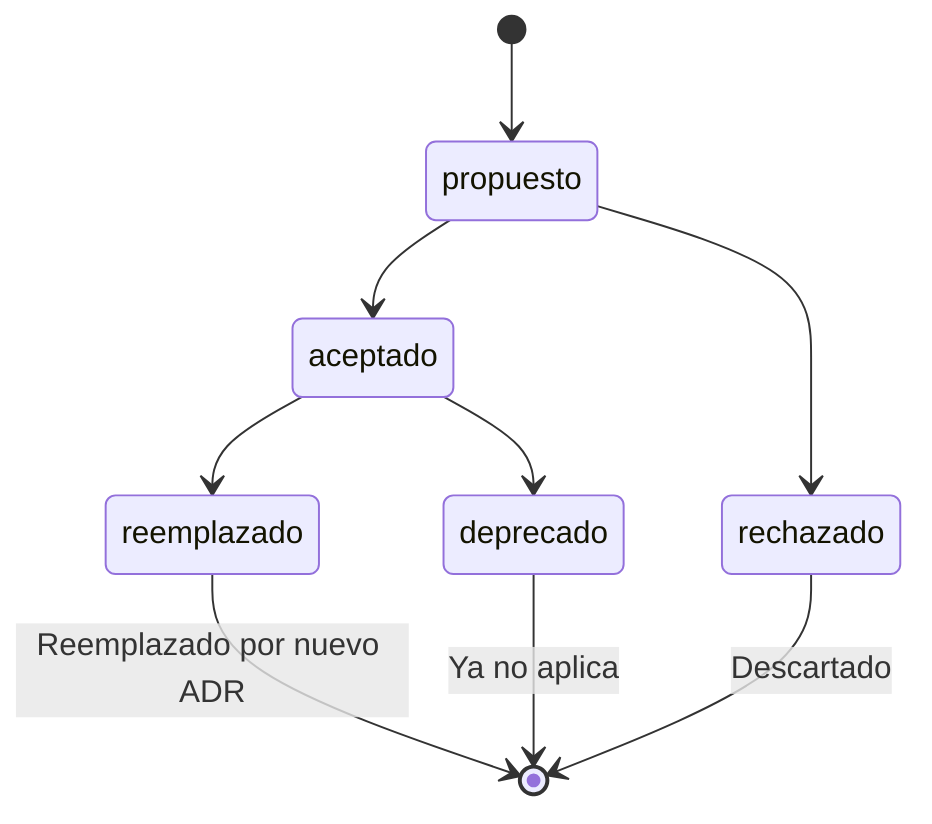

# Architecture Decision Records (ADRs)

## Propósito

Esta carpeta almacena los **Architecture Decision Records (ADRs)** del proyecto.
Un ADR es un documento breve e inmutable que captura una decisión arquitectónica
significativa junto con su contexto, las alternativas consideradas y las
consecuencias esperadas.

El objetivo es construir una bitácora de decisiones técnicas que permita a
cualquier persona comprender **POR QUÉ** el sistema está diseñado de la manera
en que lo está.

---

## Convención de nombres (MADR)

Basado en [MADR](https://adr.github.io/madr/):

```
ADR-NNN-descripcion-breve-en-kebab-case.md              (aceptado)
ADR-NNN-Deprecado-descripcion-breve.md                    (deprecado)
ADR-NNN-Reemplazado-descripcion-breve.md                  (reemplazado)
```

- `ADR` — Prefijo fijo.
- `NNN` — Número secuencial de 3 dígitos.
- Estado `Deprecado` o `Reemplazado` solo aparece en el nombre si NO es "aceptado".

---

## Inmutabilidad (regla fundamental)

Los ADRs son **READONLY** una vez creados.

**✅ Se puede:**
- Cambiar el nombre del archivo para reflejar un cambio de estado.
- Actualizar el campo "Estado" en los metadatos.

**❌ No se puede:**
- Modificar el contenido sustancial (contexto, alternativas, decisión, consecuencias).
- Si una decisión necesita cambiar, se crea un **nuevo ADR** que referencia al anterior.

---

## Ciclo de vida MADR



| Estado | Significado |
|--------|-------------|
| **propuesto** | En evaluación, pendiente de aprobación |
| **aceptado** | Vigente. Guía autoritativa de arquitectura |
| **rechazado** | Evaluada y rechazada (registro de alternativas descartadas) |
| **deprecado** | Completamente implementada o ya no relevante |
| **reemplazado** | Reemplazada por un ADR más reciente |

---

## Estructura recomendada

1. **Título y metadatos** — Número, nombre, fecha, estado, decisores.
2. **Contexto** — Problema o necesidad que motivó la decisión.
3. **Alternativas consideradas** — Opciones evaluadas con pros y contras.
4. **Decisión** — Declaración clara de lo decidido.
5. **Consecuencias** — Impacto positivo, trade-offs, deuda técnica.
6. **Referencias** — Links a documentos, estándares, otros ADRs.

### Diagramas y Elementos Visuales

Usar **Mermaid** obligatoriamente para todos los diagramas, gráficos y cualquier otro elemento visual (no ASCII art ni imágenes embebidas).

---

## Regla para agentes AI

| Estado | Acción | Motivo |
|--------|--------|--------|
| **aceptado** | ✅ **CONSULTAR Y RESPETAR** | Guía autoritativa vigente |
| **propuesto** | 👁️ **LEER como contexto** | Puede ser relevante pero aún no es obligatorio |
| **rechazado** | ⛔ **IGNORAR** | Decisión descartada, no aplicar |
| **deprecado** | ⛔ **IGNORAR** | Ya no aplica al proyecto |
| **reemplazado** | ⛔ **IGNORAR** | Sustituido por un ADR más reciente |

> **Regla práctica:** Si el nombre del archivo contiene `Deprecado` o `Reemplazado`, ignorar.
> Solo seguir instrucciones de ADRs en estado `aceptado`. Los `propuesto` pueden consultarse
> para entender decisiones en curso, pero no son vinculantes.

---

## ¿Qué define un ADR?

**Sí:** Plataforma tecnológica, estructura de capas, patrones de diseño,
convenciones de código, estrategia de testing, configuración de hardware.

**No:** Reglas de negocio (→ Discovery), pasos de implementación (→ Spec),
hallazgos de revisión (→ Review), registro de lo implementado (→ Memory).

---

## Requisitos No Funcionales (NFRs)

Los **requisitos no funcionales** (rendimiento, seguridad, disponibilidad,
escalabilidad, observabilidad, etc.) se documentan **dentro de los ADRs** como
una sección dedicada cuando la decisión arquitectónica los impacta directamente.

### ¿Cómo se registran?

| Escenario | Dónde documentar |
|-----------|-----------------|
| Un ADR **define** un NFR (ej. "elegimos Redis para lograr < 50ms p99") | Sección "NFRs aplicables" del ADR |
| Un NFR **motiva** una decisión (ej. "necesitamos 99.9% uptime") | Campo "Contexto" del ADR + sección NFRs |
| Un NFR es **transversal** a varias decisiones (ej. política de seguridad) | ADR dedicado tipo "ADR-NNN-nfr-politica-seguridad" |

### Estructura de la sección NFRs

```markdown
## NFRs aplicables

| NFR | Descripción | Umbral | Cómo se mide |
|-----|-------------|--------|--------------|
| Latencia | Respuesta del endpoint /api/x | < 200ms p95 | Métricas APM |
| Disponibilidad | Servicio principal | 99.9% mensual | Health checks |
```

> **Regla:** Todo ADR que impacte un NFR **debe** incluir esta tabla. Si un
> NFR no tiene ADR asociado, es una señal de que falta una decisión
> arquitectónica documentada.

---

## Índice de documentos

Ver **[INDEX.md](INDEX.md)** para el listado de ADRs vigentes y reemplazados.
