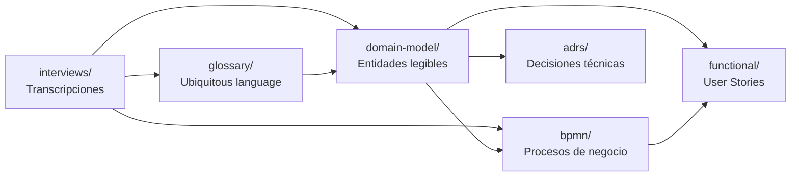

# Analysis (Análisis de Dominio)

## Propósito

Esta carpeta contiene el **análisis estructurado del dominio de negocio**: entrevistas
con stakeholders, modelado de entidades y relaciones (ontología), y definición de
procesos de negocio. Es la fase que transforma el material crudo de `input/` en
conocimiento formal y accionable.

A diferencia de `discovery/` (que explora sistemas y tecnología), `analysis/` se
enfoca en **entender el negocio**: qué entidades existen, cómo se relacionan, y qué
procesos las mueven. Este conocimiento es la base directa para escribir User Stories,
ADRs y Specs.

---

## Estructura

```
analysis/
├── interviews/     Transcripciones de entrevistas con stakeholders
├── glossary/       Ubiquitous language (glosario de términos del dominio)
├── domain-model/   Modelo de dominio legible (entidades, propiedades, relaciones, enums)
└── bpmn/           Procesos de negocio (flujos que usan las entidades del dominio)
```

---

## Flujo de trabajo



1. **Interviews** — Se graban y transcriben las conversaciones con stakeholders.
   La IA extrae entidades, relaciones y procesos candidatos.
2. **Glossary** — Se consensúan los términos del dominio (ubiquitous language).
   Esto alinea al equipo antes de modelar.
3. **Domain Model** — Se documentan las entidades, propiedades, relaciones y
   enumeraciones en formato Markdown legible y editable. Es la fuente de verdad
   para discusión con negocio.
4. **BPMN** — Se definen los procesos de negocio usando las entidades del modelo.
   Cada proceso describe un flujo que involucra una o más entidades.

El resultado alimenta directamente `functional/` (User Stories + Bolts) y
`adrs/` (decisiones de modelado).

---

## Relación con otras carpetas

| Carpeta        | Relación                                                         |
|----------------|------------------------------------------------------------------|
| `input/`       | Material crudo (grabaciones, docs del cliente) que se analiza aquí |
| `discovery/`   | Hallazgos técnicos/legacy que complementan el análisis de dominio |
| `functional/`  | Las US se derivan de las entidades del domain-model y procesos (BPMN) |
| `adrs/`        | Decisiones de modelado de dominio se formalizan como ADRs        |
| `spec/`        | Las Specs implementan lo que el análisis definió                 |

---

## ¿Analysis o Discovery?

Si no sabés dónde documentar algo, usá esta tabla:

| ¿Estoy investigando... | Va en... |
|---|---|
| Reglas de negocio, entidades del dominio, procesos | `analysis/` |
| Código legacy, schemas de BD, APIs externas, integraciones | `discovery/` |
| Ambas cosas al mismo tiempo | Documentá el dominio en `analysis/`, lo técnico en `discovery/`. Cross-linkealos. |
| Una entrevista con un stakeholder | `analysis/interviews/` |
| Un análisis de una base de datos legacy | `discovery/` |
| Un glosario de términos del negocio | `analysis/glossary/` |
| Un mapeo de endpoints de un sistema viejo | `discovery/` |

**Regla práctica:** Si el hallazgo describe **qué hace el negocio** → `analysis/`. Si describe **cómo funciona el sistema actual** → `discovery/`.

---

## Organización

Cada subcarpeta tiene su propio README con convenciones específicas. La organización
interna de cada subcarpeta es libre — el analista decide cómo agrupar los archivos
(por módulo, por sprint, por stakeholder, etc.).

---

## Notas

- Las entrevistas se transcriben y almacenan tal cual. El análisis derivado va en
  `domain-model/` y `bpmn/`.
- Domain model y BPMN son complementarios: domain-model define el **qué** (entidades
  estáticas) y BPMN define el **cómo** (comportamiento dinámico).
- Juntos dan una descripción completa del dominio que permite generar User Stories
  con mínima ambigüedad.
