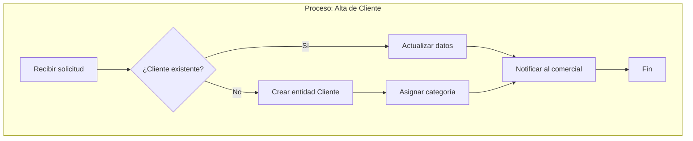

# BPMN (Procesos de Negocio)

## Propósito

Esta carpeta contiene la definición de los **procesos de negocio** del dominio,
modelados usando la notación estándar **BPMN 2.0** (Business Process Model and
Notation). Los procesos describen el comportamiento dinámico del sistema: qué
actividades se realizan, en qué orden, quién las ejecuta y qué entidades del
dominio se ven involucradas.

`bpmn/` define el **cómo se mueven** las entidades del dominio a través de los procesos del negocio.

---

## ¿Qué se documenta aquí?

- **Procesos de negocio** — Flujos completos de trabajo (ej. "Proceso de facturación").
- **Subprocesos** — Actividades complejas que se descomponen en pasos menores.
- **Eventos** — Disparadores (inicio), intermedios y finales.
- **Gateways** — Puntos de decisión (exclusivos, paralelos, inclusivos).
- **Participantes y roles** — Quién ejecuta cada actividad (lanes/pools).
- **Flujos de datos** — Qué entidades del `domain-model/` se crean, leen, modifican o eliminan.

---

## Formato

Se usa **Mermaid** para diagramas inline en Markdown (legible en GitHub/VS Code)
y opcionalmente archivos `.bpmn` (XML estándar BPMN 2.0) para herramientas
especializadas.

### Ejemplo en Mermaid (dentro de Markdown)



### Estructura recomendada de un documento BPMN

```markdown
---
proceso: "Nombre del proceso"
fecha: "YYYY-MM-DD"
version: "1.0"
participantes: ["rol1", "rol2"]
entidades_dm: ["Entidad1", "Entidad2"]
tags: []
---

# PROC-NNN — [Nombre del proceso]

## Descripción
[Qué logra este proceso y cuándo se dispara.]

## Participantes
- **[Rol 1]** — [qué hace en este proceso]
- **[Rol 2]** — [qué hace en este proceso]

## Entidades involucradas (domain-model)
- `Cliente` — se crea/lee/modifica
- `Factura` — se crea

## Diagrama

` ` `mermaid
flowchart TB
    ...
` ` `

## Reglas de negocio
- [Regla 1]
- [Regla 2]

## Excepciones y caminos alternativos
- [Qué pasa si X falla]

## Métricas del proceso
- Tiempo promedio: [X]
- Frecuencia: [diario/semanal/etc.]
```

---

## Organización de archivos

La organización es libre. Algunas opciones:

```
bpmn/
├── PROC-001-alta-cliente.md
├── PROC-002-facturacion.md
├── PROC-003-devolucion.md
└── subprocesos/
    └── PROC-002a-validacion-fiscal.md
```

O por área funcional:
```
bpmn/
├── ventas/
│   ├── proceso-cotizacion.md
│   └── proceso-cierre-venta.md
├── operaciones/
│   └── proceso-despacho.md
└── cobranzas/
    └── proceso-cobro.md
```

---

## Cómo construir los procesos

1. **Identificar procesos** en las entrevistas (`interviews/`).
2. **Mapear entidades** — qué entidades del `domain-model/` participan en cada proceso.
3. **Definir el flujo** — secuencia de actividades, decisiones, eventos.
4. **Asignar participantes** — quién ejecuta cada paso.
5. **Documentar excepciones** — qué pasa cuando algo sale mal.
6. **Validar con stakeholders** — recorrer el proceso paso a paso.

---

## Relación con el flujo

```
interviews/ → bpmn/ (procesos) + domain-model/ (entidades) → functional/ (User Stories)
```

Los procesos BPMN se traducen directamente en **User Stories**: cada actividad
o grupo de actividades del proceso se convierte en una o más historias de usuario
con criterios de aceptación derivados de las reglas de negocio del proceso.

---

## Herramientas recomendadas

- **Mermaid** — Diagramas inline en Markdown (recomendado para este flujo).
- **Camunda Modeler** — Editor visual BPMN 2.0, gratuito.
- **bpmn.io** — Editor web open-source.
- **Bizagi Modeler** — Editor visual gratuito (Windows).

---

## Referencias

- [BPMN 2.0 Specification (OMG)](https://www.omg.org/spec/BPMN/2.0/)
- [Mermaid Flowchart Syntax](https://mermaid.js.org/syntax/flowchart.html)

---

---

## Ciclo de vida de un proceso

| Estado | Significado |
|--------|-------------|
| **vigente** | El proceso describe un flujo vigente del negocio. |
| **deprecado** | El proceso ya no refleja la operación actual. Se mantiene como referencia histórica. |

El INDEX.md refleja el estado: ✅ Vigentes (vigente) / ⛔ Deprecados (deprecado).

---

## Índice de documentos

Ver **[INDEX.md](INDEX.md)** para el listado de procesos documentados.
