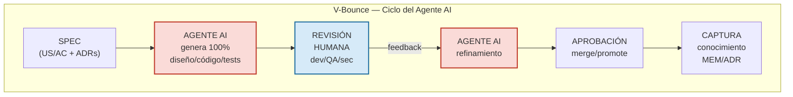

# 1 — Introducción

Incorporar metódicamente inteligencia artificial (IA) al ciclo de vida del
software genera beneficios verificables en **velocidad de entrega** y **calidad**,
siempre que se integre con prácticas sólidas de ingeniería y gobernanza.

Desde la perspectiva de **entrega**, la evidencia experimental muestra mejoras
sustanciales en tiempos de desarrollo cuando los equipos usan agentes de código.
Las pruebas empíricas han encontrado que los agentes terminan tareas en minutos
y horas en lugar de horas y días.

En **calidad**, la IA contribuye a expandir la cobertura y profundidad de tests
y revisiones. Evaluaciones empíricas **de generación de tests** con LLMs reportan
cobertura promedio competitiva y mejor que técnicas automatizadas recientes,
acelerando la detección temprana de defectos y regresiones; estos resultados
mejoran con *prompting* cuidadoso y revisión humana.

Para asegurar que los beneficios se traduzcan en **resultados sostenibles**, es
esencial instrumentar y **monitorear métricas de rendimiento de entrega** como
DORA (lead time, frecuencia de despliegue, tasa de fallo en cambios y MTTR),
usándolas como señales de eficiencia del SDLC y vinculándolas a objetivos de
negocio. La investigación longitudinal sintetizada en ***Accelerate*** muestra
que la mejora sistemática de estas métricas correlaciona con mayor rendimiento
organizacional y estabilidad operativa; en este marco, la IA, correctamente
integrada en el pipeline de desarrollo y operación, **actúa como acelerador**
de estas capacidades.

Este documento presenta **AI-Native-SDLC** como metodología operativa y framework
para desarrollo de software asistido por IA, basado en el documento "AI-Driven
Development Life Cycle: Reimagining Software Engineering" creado por Raja SP,
Principal Solutions Architect en AWS.

<https://aws.amazon.com/es/blogs/devops/ai-driven-development-life-cycle/>
<https://prod.d13rzhkk8cj2z0.amplifyapp.com/>

El término "metodología" se usa para referirse al conjunto organizado de procesos,
prácticas y métricas que guían el trabajo; y "framework" para el andamiaje conceptual
y técnico que articula roles, artefactos, flujos y controles. Para su framework, el
enfoque se basa en frameworks y estándares del ciclo de vida de software y seguridad
que favorecen trazabilidad y gobernanza desde el inicio.

El enfoque busca alinearse con procesos del ciclo de vida del software y mantener
compatibilidad conceptual con modelos clásicos como el **V-Model** mapeando
verificación/validación y sus entregables.

**AI-Native-SDLC es la metodología y framework propios de Avenga LATAM**, desarrollados
por el equipo de investigación para sistematizar el desarrollo de software asistido
por IA.

El proceso se gobierna por **métricas de flujo y calidad** alineadas con evidencia
empírica sobre rendimiento de entrega, favorece la transferencia de conocimiento y
mantiene compatibilidad con estándares sin perder foco en la realidad operativa.
El resultado: convertir ideas en entregables en horas o pocos días, de forma
predecible, auditable y escalable.

AI-Native-SDLC estructura el trabajo en **Bolts** (unidades de valor con *timebox*
de **2 horas a 1 día** y un resultado demostrable y medible) y operacionaliza cada
Bolt a través de **V-Bounce**.

**V-Bounce** es el micro-ciclo operativo de AI-Native-SDLC, definido por este equipo
de investigación: parte de un *input* validado (Spec con US/AC/ADRs), el **agente AI
genera el 100% de los artefactos** (diseño, código, tests), y luego se aplica revisión
humana, refinamiento, aprobación técnica y captura de conocimiento (ej. ADR y
checklist), entregando incrementos demostrables dentro del *timebox* del Bolt.

Conceptualmente derivado del **V-Model** al hacer explícita verificación y validación,
mapea procesos del ciclo de vida establecido. Su esencia es **human-in-the-loop como
validador** para asegurar calidad, robustez y trazabilidad de punta a punta. La
gestión se ancla en **métricas de flujo** (lead time, throughput y tasa de compromisos
cumplidos) en línea con evidencia de rendimiento de entrega (*Accelerate*/DORA).

> **Principio fundamental:** Todo el código, diseño y tests son generados **100% por
> agentes AI**. Los tiempos de los Bolts se miden en **tiempo de ejecución del agente
> AI** (AI-time), no en horas-hombre. El humano actúa exclusivamente como **validador
> y aprobador** en puntos críticos del ciclo.

Operativamente, el flujo comienza con **entrevistas grabadas con *stakeholders***:
la IA transcribe y propone user stories, criterios de aceptación (ACs), riesgos y
requisitos no funcionales (NFRs) para ADRs; luego el equipo valida y ajusta en un
esquema **human-in-the-loop** para asegurar calidad, robustez y trazabilidad de
punta a punta. Para la definición verificable de ACs, se recomienda el formato
**Given/When/Then** de BDD.

Finalmente, el lado racional del enfoque se apoya en **evidencia empírica mixta**:
hay mejoras de productividad y satisfacción en tareas limitadas con asistentes de
código, pero también resultados que apuntan a **ralentizaciones** en desarrolladores
expertos trabajando en repositorios conocidos si no hay buena orquestación y
gobernanza. De ahí la importancia de micro-ciclos controlados (V-Bounce), artefactos
medibles (Bolts) y métricas de flujo para capturar beneficios y limitar riesgos.

## Objetivos de la metodología

1. Acelerar la entrega de valor usando IA desde la concepción hasta la operación.
2. Elevar la calidad incorporando testing y validación en cada V-Bounce, con Definition of Done clara.
3. Aumentar la predictibilidad con Bolts como unidad de promesa y medición.
4. Mejorar la trazabilidad entre entrevistas, requerimientos, diseño, código, tests y decisiones (**ADRs**).
5. Reducir el retrabajo con **Definition of Ready/Done** claras y **gates automatizados** en CI/CD, apoyados en prácticas de seguridad y cadena de suministro.

## Beneficios esperados

1. Ciclos más cortos (**horas/días**) sin perder rigor.
2. Mejor alineamiento con el equipo de negocio: cada Bolt tiene un criterio de demo específico.
3. Transparencia: **métricas simples** para gestión y **señales técnicas** para ingeniería.
4. Aprendizaje continuo: cada V-Bounce captura *prompts*, decisiones y lecciones (**ADRs**).

## ¿Para quién es?

Para equipos de ingeniería, QA, producto y líderes de proyecto que quieren operar
con IA como **generador primario de todo el diseño, código y tests**, manteniendo
al humano como validador y aprobador en puntos críticos.

En las secciones siguientes encontrarás el glosario, los principios, el flujo completo
(desde entrevistas hasta despliegue), plantillas operativas (US+AC, ADR, Bolt, V-Bounce),
métricas y un plan de adopción por fases.

---

# 2. Glosario y conceptos clave

### 2.1 Entrevistas grabadas (fuente primaria)

**Qué son:** Conversaciones (audio/video) con stakeholders que capturan objetivos,
restricciones, riesgos y métricas de éxito.

**Para qué sirven:** Son el **input** de todo el flujo AI-Native-SDLC: la IA transcribe
y prepara documentos iniciales (User Stories, ACs, riesgos y NFRs para ADRs), que el
equipo luego valida.

**Buenas prácticas:** agenda clara, preguntas de clarificación, ejemplos concretos,
acuerdos de privacidad, consentimiento de grabación.

### 2.2 Intent (Intención)

**Qué es:** La intención de negocio o técnica de alto nivel (el "para qué"). Los
objetivos del producto de software. Puede haber uno o más Intents en un proyecto,
que buscan satisfacer las necesidades del Stakeholder.

**Output esperado:** 1–3 frases, con métricas de éxito tentativas (ej. "reducir
tiempos de onboarding en 30%").

**Uso:** La IA lo descompone en **Units** y sugiere **Bolts iniciales.**

### 2.3 Unit (Unidad)

**Qué es:** Bloque cohesivo de valor (como un Epic/Subdominio) con fronteras claras,
que puede desplegarse y evolucionar de forma relativamente autónoma.

**Relación:** Un **Intent** se divide en **Units**; cada **Unit** se implementa con
**Bolts**.

### 2.4 Bolt (Unidad de Trabajo y Seguimiento)

**Qué es:** Paquete de entrega de valor con **timebox de 2 horas a 1 día**, orientado
a un resultado **demostrable** y **medible**.

**Rol:** Es la **moneda de planificación y medición** (lead time, throughput, % de
compromisos cumplidos).

**Relación con V-Bounce:** Un **Bolt** se ejecuta usando **1..n V-Bounces** hasta
cumplir su **Definition of Done** (DoD).

> **Estimación en AI-time:** El timebox del Bolt se mide en **tiempo de ejecución
> del agente AI** (tiempo que tarda el agente en generar todos los artefactos +
> tiempo de revisión humana), no en horas-hombre de desarrollo. Un Bolt que antes
> tomaba 8 horas de un desarrollador, con un agente AI puede completarse en 2 horas
> de AI-time + revisión.

### 2.5 V-Bounce (forma estándar de ejecutar)

**Qué es:** El micro-ciclo de trabajo donde un **agente AI toma una Spec** y la
ejecuta de principio a fin:

**Spec → Agente AI genera 100% (diseño/código/tests) → Revisión Humana → Refinamiento
→ Aprobación Técnica → Captura de Conocimiento.**

**Rol:** Garantiza calidad desde el minuto cero (tests integrados y validación),
reduce retrabajo y documenta decisiones.

> **Agente AI como ejecutor:** El V-Bounce es el resultado de la interacción del
> agente AI con la Spec. El agente recibe la Spec como input, genera autónomamente
> todos los artefactos (código, tests, configuración, documentación), y el humano
> actúa como **validador** del resultado. El agente puede ejecutar múltiples
> iteraciones internas antes de presentar el resultado al humano para revisión.

### 2.6 User Stories (US) + Criterios de Aceptación (AC)

**US:** "Como [rol] quiero [capacidad] para [valor]."

**AC:** Condiciones verificables estilo **Given/When/Then** (criterios funcionales solamente).

**Rol:** Sirven como **contrato humano ↔ AI**: guían la generación de código y tests
y facilitan la validación rápida.

### 2.7 NFRs (Requisitos No Funcionales)

**Qué son:** Rendimiento, seguridad, disponibilidad, compliance, observabilidad, etc.

**Rol:** Los NFRs se documentan en **ADRs** (Architecture Decision Records), no en
User Stories ni ACs. Se hacen cumplir a través de **quality gates automatizados** en
CI/CD para que la IA los respete al generar y se midan automáticamente.

### 2.8 ADR (Architecture Decision Record)

**Qué es:** Registro breve de una decisión técnica relevante (contexto, alternativas,
decisión, consecuencias).

**Rol:** Mantiene trazabilidad de trade-offs y evita el olvido; se actualiza en el
V-Bounce donde se tomó la decisión.

### 2.9 DoR / DoD (Definition of Ready / Definition of Done)

**DoR (para V-Bounce/Bolt):** US+AC claros, ADRs relevantes revisados (incl. NFRs),
riesgos identificados, contexto accesible para el agente AI, criterios de demo.

**DoD (por V-Bounce/Bolt):** Código + **tests auto-generados** ejecutados y en verde,
revisión humana aprobada, ADR actualizado si aplica, evidencia de gates, trazabilidad
completa, listo para demo.

### 2.10 Quality Gates (automatizados)

**Qué son:** Verificaciones obligatorias en CI/CD (tests, cobertura, SAST/DAST,
licencias/SBOM, performance smoke, políticas).

**Rol:** Los ACs y NFRs **se convierten** en verificaciones automáticas; un Bolt no
pasa a **Done** si los gates fallan.

### 2.11 Deployment Unit (Unidad de Despliegue)

**Qué es:** Artefacto listo para promover (imagen/función/IaC) que **ya pasó** todos
los gates y es demostrable.

**Rol:** Es el output "releasable" de una o más secuencias de Bolts dentro de una Unit.

### 2.12 Memoria del proyecto

**Qué es:** Conjunto de artefactos (transcripciones, US/AC, ADRs, código, tests,
métricas) accesibles por la IA y el equipo.

**Rol:** Permite que la IA genere con contexto correcto y asegura trazabilidad
**end-to-end**.

### 2.13 Métricas clave

1. **Lead time por Bolt:** horas/días desde "Ready" hasta "Done" (medido en AI-time).
2. **Throughput semanal:** # de Bolts cerrados.
3. **% Compromiso cumplido:** Comprometidos vs. cerrados en la semana.
4. **Bounces por Bolt:** Promedio de V-Bounces ejecutados (buscamos pocos y efectivos).
5. **Tasa de aprobación en 1er paso:** % de outputs del agente AI aprobados sin refinamiento extra.
6. **Fuga de defectos:** defectos que llegan a UAT/producción.
7. **Costo/Token (opcional):** economía de IA por Bolt/Unit.

---

# 3. Principios y reglas operativas

Esta sección establece el **framework de AI-Native-SDLC**: cómo pensamos y cómo
actuamos. Puede usarse como un "contrato de trabajo" para el equipo.

### 3.1 Principios (no negociables)

- **La IA genera, los humanos validan.**
  Los agentes AI generan el 100% de los entregables (docs/diseño/código/tests);
  el equipo revisa, valida y aprueba. El rol humano es validador, no co-autor.

- **Valor pequeño y demostrable.**
  Todo se descompone en **Bolts de 2 horas a 1 día** con criterio de demo claro.

- **V-Bounce como forma estándar de ejecutar.**
  Cada Bolt se ejecuta con la secuencia: *Spec → Agente AI genera 100% → Revisión
  Humana → Refinamiento → Aprobación Técnica → Captura de Conocimiento*.

- **Diseño y testing primero.**
  Diseño (Dominio/Lógico) y **tests auto-generados** nacen junto con la funcionalidad,
  no después.

- **Trazabilidad de punta a punta.**
  Desde **entrevistas** → US/AC → diseño → código → tests → ADR (incl. NFRs) → demo.
  Todo vinculado.

- **Métricas simples, decisiones con datos.**
  Medimos Velocidad: Lead time por Bolt (AI-time), V-Bounces por Bolt.
  Configuración: % Compromiso cumplido, Cobertura de Alcance (US), Tasa de Aprobación
  Total, Tasa de Aprobación Go-Live.

- **Cadencia liviana, foco en flujo.**
  1 semana para plan/demo; el trabajo real ocurre en **Bolts** y **V-Bounces**.

- **Calidad automatizada.**
  Un Bolt no está "Done" si cualquier **gate** (tests, seguridad, licencias,
  perf-smoke) falla.

- **El conocimiento es producto.**
  Prompts, decisiones y lecciones aprendidas se capturan en cada bounce.

- **Seguridad y compliance por defecto.**
  Políticas y *gates* son parte del flujo, no un "extra".

### 3.2 Reglas de Bolts (unidad de promesa/medición)

- **Tamaño:** **2 horas a 1 día** como objetivo (medido en AI-time). Si excede, **dividir**.

- **Contenido:** Un "slice" verificable o una **decisión de diseño** formalizada (ADR).

- **DoR (Ready):**
  - US + AC claros (criterios funcionales). ADRs relevantes revisados.
  - Riesgos/controles identificados.
  - Contexto disponible para el agente AI (links/artefactos).
  - Criterio de demo + estimación (en AI-time).

- **DoD (Done):**
  - Código + **tests auto-generados** ejecutados y **en verde** (CI).
  - Revisión humana **aprobada**.
  - ADR actualizado (si hubo decisiones).
  - Evidencia de **gates** (seguridad, licencias, perf).
  - **Trazabilidad completa** (story ↔ diseño ↔ código ↔ tests) y lista de demo.

- **Planificación semanal:** usar **Commit (85%)** + **Stretch (50%)** y
  **buffer 10–20%**.

- **WIP:** ideal **1 Bolt activo por persona/agente**. Evitar multitasking.

### 3.3 Reglas de V-Bounce (forma de ejecutar)

- **Anatomía fija:**
  1. **Spec** lista (US/AC/artefacto + ADRs relevantes).
  2. **Agente AI genera el 100%** de docs/diseño/código/tests.
  3. **Revisión y validación humana** (dev/QA/seguridad).
  4. **Refinamiento por agente AI** basado en feedback.
  5. **Aprobación** (merge/promote/package).
  6. **Captura de conocimiento** (prompts, lecciones, links CI/ADR).

- **Cantidad por Bolt:** las necesarias (típico 1–3).

- **Tiempo:** Se mide en **minutos/horas de AI-time**; si toma más de 1 día,
  revisar DoR o dividir el Bolt.

- **Test-first con agente AI:** El agente deriva **tests** desde ACs y restricciones
  de ADRs; los usa como "freno" del bounce.

- **Criterios de calidad:**
  - **Aprobación en 1er paso** como objetivo (reduce retrabajo).
  - Gates obligatorios en CI: unit/integration, cobertura mínima, SAST/DAST,
    licencias/SBOM, **perf-smoke** (p95), linting/políticas.

### 3.4 Reglas de inception basada en entrevistas (motor de backlog)

- **Entrevistas grabadas** (audio/video) con consentimiento; agenda de objetivos
  y métricas.

- **Transcripción + Elaboración AI:** US, AC, NFRs, riesgos, **agrupación en Units**
  y sugerencia de **Bolts iniciales.**

- **Validación humana:** cerrar ambigüedades, fijar métricas y priorizar.

- **Output mínimo:** backlog priorizado, **Registro de Riesgos**, mapa Units → Bolts,
  y criterios de demo para las primeras 1–2 semanas.

### 3.5 Reglas de diseño y decisiones (ADRs)

- **Diseño dual:**
  - **Diseño de Dominio** (DDD táctico) para modelos de negocio.
  - **Diseño Lógico** (patrones/NFR/plataforma) para decisiones técnicas.

- **ADR de 1 página** por decisión relevante (contexto, alternativas, decisión,
  consecuencias).

- **Momento:** El ADR se cierra en el **V-Bounce** donde se tomó la decisión.

### 3.6 Quality Gates (mínimos obligatorios)

- **Funcional:** tests unitarios + integración **en verde.**

- **Seguridad:** SAST (pipeline), DAST básico si aplica, dependencias y
  **licencias/SBOM**.

- **Rendimiento:** **perf-smoke** con umbrales (p95), al menos para endpoints
  críticos.

- **Políticas:** *branch protection*, revisiones requeridas, estándares de estilo.

- **Observabilidad:** logs/métricas/traces básicos incluidos en el Bolt cuando
  es backend/servicios.

- Si cualquier gate falla, el Bolt **no puede** pasar a **Done**.

### 3.7 Métricas oficiales (y cómo usarlas)

- **Lead Time por Bolt** (Ready → Done): objetivo en **horas/días** (AI-time).
- **Throughput semanal:** # de Bolts cerrados.
- **% Compromiso cumplido:** Comprometidos vs. Cerrados.
- **V-Bounces por Bolt:** promedio (buscamos bajar sin perder rigor).
- **Tasa de aprobación en 1er paso:** % outputs del agente AI aprobados sin
  refinamiento extra.
- **Fuga de defectos:** defectos que llegaron a UAT/producción.
- **Opcional:** **Costo/token por Bolt** para evaluar ROI de IA.
- **Ajuste semanal:** si no se cumple el Commit, reducir tamaño/número de Bolts
  o mejorar DoR. Si hay exceso de capacidad, promover Stretch a Commit.

### 3.8 Priorización y clases de servicio

- **Clases:** *Regulatorio*, *Incidente/Hotfix*, *Feature/Valor*, *Deuda/Hardening*.

- **Reglas:**
  - Regulatorio/Incidente tienen **preferencia inmediata**.
  - Si un Bolt crítico no sale en ≤ 1 día, **dividirlo** y encadenarlo.
  - Deuda/Hardening: reservar **10–20%** semanal.

### 3.9 Roles mínimos

- **PO/PM:** Define Intent/valor, prioriza **Bolts**, acepta demos.

- **Dev-validador:** Orquesta **V-Bounces**, revisa y valida outputs generados por
  el agente AI, actualiza ADRs.

- **AI Orchestrator/TL:** Herramientas, memoria, prompts, políticas; supervisa
  prácticas de vibe coding, gates y trazabilidad. Configura y mantiene los agentes AI.

- **QA/Seguridad:** Define y mantiene *gates*, co-diseña estrategia de testing
  con el agente AI.

### 3.10 Anti-patrones (lo que NO hacemos)

- **Bolts "elefante"** (> 1 día) o vagos ("mejorar performance" sin umbrales).

- **V-Bounces sin tests** (sin freno objetivo).

- **Diseño "fantasma"** (decisiones sin ADR).

- **Sprints como "canasta"** para esconder retrasos (el número importante es
  **Bolts Done**, no "estar ocupado").

- **Memoria sucia:** artefactos sin vincular; prompts/lecciones sin capturar.

- **Humano escribiendo código:** Si el humano está escribiendo código en lugar de
  validar lo que genera el agente AI, el flujo está roto.

### 3.11 Niveles de aprobación y aceptación (Política)

**Objetivo:** Clarificar qué significa "Aprobación" en cada instancia y quién decide.

**Niveles:**

1. **Aprobación Técnica del V-Bounce (Interna)**

   - **Qué valida:** calidad del output del V-Bounce (código/tests/diseño/ADR)
     + gates en verde.
   - **Quién:** Dev-validador (peer), QA y/o Seguridad según corresponda.
   - **Output:** merge/promote del artefacto al branch/environment destino.
     *No implica aceptación de negocio.*

2. **Aceptación del Bolt (Valor/PO)**

   - **Qué valida:** se cumple el criterio de demo del Bolt (US+AC relevantes).
   - **Quién:** PO/PM (o quien represente al negocio).
   - **Cuándo:** en la demo semanal o asincrónicamente (comentario en PR/ticket).
   - **Output:** Bolt = Done. Si hay feedback, se crean nuevos Bolts.

3. **UAT por Unit/Milestone (cliente)**

   - **Qué valida:** alcance integral de la Unit contra ACs de negocio.
   - **Quién:** Stakeholders/cliente.
   - **Output:** Acta de UAT aprobada o Lista de Ajustes (Nuevos Bolts).

---

# 4. Proceso de punta a punta (de entrevistas a producción)

Esta sección describe **cómo se trabaja de principio a fin**: qué entra, qué sale,
quién interviene y qué artefactos quedan. El hilo conductor es **entrevistas grabadas
→ documentación generada por IA → validación humana → Bolts ejecutados con V-Bounces
por agentes AI → entrega demostrable**.

### 4.1 Inception basada en entrevistas (motor de backlog)

**Objetivo:** Convertir entrevistas grabadas y documentación en **artefactos
accionables**.

**Input**

- Entrevistas (audio/video) con stakeholders.
- Objetivos de negocio, restricciones, métricas de éxito.
- Políticas de privacidad/consentimiento.

**Pasos**

1. **Transcripción con IA** (limpieza de muletillas, identificación de interlocutores).
2. **Elaboración AI:** propone **Contexto de Negocio**, **User Stories (US)**, **AC**,
   **riesgos**, **NFRs** (derivados a ADRs), **preguntas abiertas** y un primer
   **mapa de Units**.
3. **Revisión humana:** El equipo **valida**, resuelve ambigüedades y **ajusta**
   redacción, métricas y alcance.
4. **Priorización:** Ordenar Units y Stories por valor, riesgo y urgencia.
5. **Sugerencia de Bolts:** La IA propone **bolts candidatos** (2h–1 día) vinculados
   a cada Story / Unit.

**Output**

- **Backlog priorizado** (US + AC + riesgos). NFRs documentados en ADRs.
- **Registro de Riesgos inicial.**
- **Mapa Units → Bolts** (primeras 1–2 semanas).
- **Criterios de demo** por Bolt.
- **Reporte de proyecto actualizado** (links a todo).

**Checklist Inception**

- Transcripciones listas.
- US+AC generados y validados; NFRs capturados en ADRs.
- Riesgos con dueño/control.
- Units y Bolts sugeridos.
- Criterios de demo definidos.

### 4.2 Refinamiento

**Objetivo:** "dejar listo para bouncear".

**Pasos**

- Completar **Definition of Ready (DoR)** de los **bolts** priorizados.
- Cerrar preguntas abiertas con stakeholders (si quedan).
- Alinear **métricas** y **umbrales** (ej. p95 ≤ 300ms, roles permitidos, etc.).

**Output**

- Lista de **Bolts Ready** (cumplen DoR) con estimación en AI-time y criterios de demo.

### 4.3 Planificación semanal (cadencia liviana)

**Objetivo:** Fijar expectativas claras sin burocracia.

**Pasos**

1. **Forecast con datos:** throughput histórico y lead time de bolts (P50/P85).
2. **Commit + Stretch:** Comprometer los **P85** y dejar 1–3 **Stretch** (opcionales).
3. **Buffer 10–20%:** reservar tiempo para bloqueantes, soporte, hardening.

**Output**

- **Plan semanal:** lista de Bolts Commit y **Stretch**, dueños y criterios de demo.

### 4.4 Ejecución de Bolts con V-Bounce

**Objetivo:** Cerrar cada Bolt con calidad incorporada.

**Anatomía del V-Bounce (ciclo del agente AI)**

1. **Spec lista** (US/AC, artefactos vinculados a memoria + ADRs relevantes).
2. **Agente AI genera el 100%** (diseño/código/tests/ADRs).
3. **Revisión y validación humana** (dev/QA/seguridad).
4. **Refinamiento por agente AI** (ajustes basados en feedback).
5. **Aprobación** (merge/promote/package).
6. **Captura de conocimiento** (prompts, lecciones, links CI/ADR).

**Reglas**

- **1..n V-Bounces por Bolt** (típico 1–3).
- Si un Bolt excede **1 día** → **dividir**.
- **Tests desde minuto cero** derivados de ACs y restricciones de ADRs.

**DoR Bolt (resumen)**

- US + AC claros (criterios funcionales) + ADRs revisados.
- Riesgos/controles identificados.
- Contexto accesible para el agente AI.
- Estimación (AI-time) y criterios de demo.

**DoD Bolt (resumen)**

- Código + tests auto-generados (CI) **en verde**.
- Revisión humana aprobada.
- ADR actualizado (si aplica).
- Evidencia de gates (seguridad/licencias/perf).
- **Trazabilidad completa** y listo para demo.

**Output**

- Bolt **Done** con demo, evidencia y trazas a código/tests/ADRs.

### 4.5 Integración continua y Quality Gates

**Objetivo:** Convertir ACs y restricciones de ADRs (incl. NFRs) en **verificaciones
automáticas**.

**Gates mínimos**

- **Funcional:** tests unitarios + integración (cobertura mínima).
- **Seguridad:** SAST/DAST básico, dependencias, licencias/SBOM.
- **Rendimiento:** perf-smoke con umbrales (p95/p99) para endpoints críticos.
- **Políticas:** branch protection, revisiones requeridas, linters/formatters.
- **Observabilidad:** logs/métricas/traces "por defecto" en servicios.

**Regla:** Si **cualquier gate falla**, el Bolt **no puede** pasar a **Done**.

### 4.6 Empaquetado y promoción (Deployment Units)

**Objetivo:** Producir artefactos **que se puedan desplegar**.

**Pasos**

1. Empaquetar (imagen/función/IaC) con versión trazable (issue/commit/build).
2. Ejecutar **deployment gates** (smoke, verificaciones de seguridad, políticas).
3. Promover a **staging** (aprobación humana) y dejar la **demo lista**.

**Output**

- **Deployment Unit** aprobada en staging, con evidencia.

### 4.7 UAT por Unit (validación formal con negocio)

**Objetivo:** Validar y firmar integralmente el alcance de la **Unit/Milestone**.

**Pasos**

- Ejecutar **scripts de demo** (o escenarios UAT) basados en ACs de negocio.
- Registrar feedback/cambios (nuevos Bolts si aplica).
- Aprobación formal del Milestone.

**Output**

- **Acta de UAT** aprobada / Lista de ajustes (nuevos Bolts) para la semana siguiente.

### 4.8 Producción, observabilidad y operaciones asistidas por IA

**Objetivo:** Operar con **alertas inteligentes** y **acciones sugeridas**.

**Pasos**

- Promover a **producción** con gates finales (change management si aplica).
- Monitoreo en tiempo real (métricas/logs/traces) con **detección de anomalías**.
- La IA sugiere **acciones** (escalado, tuning, rollback) → **aprobación humana**.

**Output**

- Output mapeado a Bolts/Units.
- **Runbooks** y **post-release checks** (errores/telemetría/UX).

### 4.9 Ciclo de feedback y mejora continua

**Objetivo:** Aprender **toda la semana**.

**Rituales**

- **Demo semanal:** Mostrar **Bolts Done** (valor tangible).
- **Retro corta:** revisar métricas y anti-patrones; ajustar DoR/DoD, prompts y gates.
- **Actualización de memoria:** consolidar lecciones, mejores prompts, ADRs frecuentes.

**Métricas clave**

- Lead time por Bolt (mediana, AI-time)
- Throughput semanal (# Bolts)
- % Compromiso cumplido
- Promedio V-Bounces por Bolt
- % Aprobación en 1er paso
- Fuga de defectos (UAT/prod)
- (Opcional) Costo/Token por Bolt

### 4.10 Flujos de excepción (Incidentes y Hotfix)

**Objetivo:** Resolver sin romper el método.

**Clases de servicio**

- **Incidente/Hotfix:** **Prioridad inmediata**; crear Bolt crítico (≤4 horas AI-time).
- **Regulatorio:** Alta prioridad con fechas; reservar capacidad fija.
- **Deuda/Hardening:** reservar **10–20%** semanal.

**Reglas**

- Mantener **gates mínimos** incluso en hotfix (al menos tests + seguridad básica).
- Post-mortem liviano → **bolts de hardening** si aplica.

### 4.11 Trazabilidad de punta a punta

**Objetivo:** Que todo esté **vinculado** para personas e IA.

**Mapa de vínculos**

1. Entrevista → Análisis (domain-model/BPMN/Glossary) → US/AC/NFR → Riesgo → Unit → Bolt → V-Bounce(s) → Código/PR
   → Tests (ejecuciones) → ADR → Build → Deployment Unit → UAT/Prod

**Buenas prácticas**

- Usar IDs/URLs de cards/issues/PRs.
- Capturar **prompts** y **decisiones** en cada V-Bounce (el conocimiento es producto).

### 4.12 Agenda de ejemplo (primera semana)

**Lunes**

- 30 minutos de planificación: **Commit** de 6 Bolts + **Stretch** (aspiracional)
  de 2 (equipo de 4 dev-validadores + agentes AI).
- Validar DoR de los primeros 3 Bolts.

**Martes–Jueves**

- Ejecutar Bolts con **V-Bounce** (1–3 bounces cada uno, ejecutados por agentes AI).
- CI con gates (tests/seguridad/perf).
- Promover a staging los que cumplen **DoD**.

**Viernes**

- **Demo:** 5–7 Bolts Done (según throughput).
- **Métricas:** lead time mediana, % Commit, promedio bounces, fallos de gates.
- **Retro:** Ajustar tamaño de Bolts/DoR/gates; registrar lecciones y prompts.

### 4.13 Resumen operativo

1. **Todo comienza en entrevistas** → IA genera docs → humanos validan.
2. **Plan semanal liviano** con **Commit + Stretch**.
3. **Bolts de 2 horas a 1 día** como unidad de promesa y medición (AI-time).
4. **V-Bounce** como forma estándar de ejecutar: agente AI genera 100% + verificación humana + tests integrados.
5. **Gates obligatorios** → sin gates en verde, no hay **Done**.
6. **Demo y métricas** cada semana → mejora continua.
7. **Trazabilidad completa** para personas e IA.

---

## 5 — Dev Flow: implementación documental de la metodología

Todos los artefactos descritos en esta metodología se materializan en la
carpeta `devflow/` del repositorio, estructurada como **Avenga AI-Native-SDLC
Dev Flow**. La siguiente tabla resume la correspondencia:

| Concepto SDLC | Carpeta Dev Flow | Artefacto |
|---------------|------------------|-----------|
| Entrevistas grabadas | `analysis/interviews/` | Transcripciones en Markdown |
| Modelo de dominio | `analysis/domain-model/` | Entidades, propiedades, relaciones (Markdown + Mermaid ER) |
| Procesos de negocio | `analysis/bpmn/` | Flujos BPMN en Mermaid/XML |
| Ubiquitous Language | `analysis/glossary/` | Glosario de términos consensuados |
| Discovery / Inception | `discovery/` | `DISC-NNN` |
| User Stories + Bolts | `functional/` | Docs US + `TEMPLATE-BOLT` |
| ADRs / NFRs | `adrs/` | `ADR-NNN` |
| Spec (V-Bounce input) | `spec/` | `SPEC-YYMMDD-HHmm` |
| Reviews / Quality Gates | `reviews/` | `REV-NNN` |
| Defectos (TDD) | `bugs/` | `BUG-NNN` |
| Riesgos | `risks/` | `RISK-NNN` |
| Memoria del proyecto | `memory/` | `MEM-YYMMDD-HHmm` + métricas DORA |
| Material crudo | `input/` | Código legacy, esquemas BD, grabaciones audio/video |
| Docs externos | `other-docs/` | Material de terceros |

> **Ver [`devflow/README.md`](../README.md)** para el flujo completo, diagramas,
> nomenclaturas y guía de Quick Start.

---

# Referencias

- **AI-Driven Development Life Cycle: Reimagining Software Engineering,** Raja SP, Principal Solutions Architect en AWS.
  <https://aws.amazon.com/es/blogs/devops/ai-driven-development-life-cycle/>
  <https://prod.d13rzhkk8cj2z0.amplifyapp.com/>

- **Amershi, S., Begel, A., Bird, C., DeLine, R., Gall, H., Kamar, E., Nagappan, N., Nushi, B., & Zimmermann, T.** (2019). Software engineering for machine learning: A case study. *2019 IEEE/ACM 41st International Conference on Software Engineering: Software Engineering in Practice (ICSE-SEIP)*, 291–300. IEEE. <https://doi.org/10.1109/ICSE-SEIP.2019.00042>

- **Butler, J., Suh, J., Haniyur, S., & Hadley, C.** (2024). *Dear Diary: A randomized controlled trial of generative AI coding tools in the workplace*. arXiv. <https://arxiv.org/abs/2410.18334>

- **Cucumber.** (2025, January 26). *Gherkin reference*. <https://cucumber.io/docs/gherkin/reference/>

- **DevOps Research and Assessment (DORA).** (2024). *Accelerate State of DevOps Report 2024*. <https://dora.dev/research/2024/dora-report/>

- **Forsberg, K., & Mooz, H.** (1992). The relationship of systems engineering to the project cycle. *Engineering Management Journal, 4*(3), 36–43. <https://doi.org/10.1080/10429247.1992.11414684>

- **Forsgren, N., Humble, J., & Kim, G.** (2018). *Accelerate: The science of lean software and DevOps—Building and scaling high-performing technology organizations*. IT Revolution. <https://itrevolution.com/product/accelerate/>

- **GitHub.** (2022, September 7). *Research: Quantifying GitHub Copilot's impact on developer productivity and happiness*. <https://github.blog/news-insights/research/research-quantifying-github-copilots-impact-on-developer-productivity-and-happiness/>

- **International Council on Systems Engineering (INCOSE).** (2015). *INCOSE systems engineering handbook: A guide for system life cycle processes and activities* (4th ed.). Wiley. <https://www.wiley.com/en-ie/INCOSE+Systems+Engineering+Handbook>

- **International Organization for Standardization, International Electrotechnical Commission, & Institute of Electrical and Electronics Engineers.** (2017). *ISO/IEC/IEEE 12207:2017—Systems and software engineering—Software life cycle processes*. <https://www.iso.org/standard/63712.html>

- **METR (Model Evaluation & Threat Research).** (2025, July 10). *Measuring the impact of early-2025 AI on experienced open-source developer productivity*. <https://metr.org/blog/2025-07-10-early-2025-ai-experienced-os-dev-study/>

- **Mosqueira-Rey, E., Hernández-Pereira, E., Alonso-Ríos, D., Bobes-Bascarán, J., & Fernández-Leal, Á.** (2023). Human-in-the-loop machine learning: A state of the art. *Artificial Intelligence Review, 56*(4), 3005–3054. <https://doi.org/10.1007/s10462-022-10246-w>

- **Nygard, M.** (2011, November 15). *Documenting architecture decisions*. Cognitect Blog. <https://www.cognitect.com/blog/2011/11/15/documenting-architecture-decisions>

- **Peng, S., Kalliamvakou, E., Cihon, P., & Demirer, M.** (2023). *The impact of AI on developer productivity: Evidence from GitHub Copilot*. arXiv. <https://arxiv.org/abs/2302.06590>

- **Schäfer, M., Nadi, S., Eghbali, A., & Tip, F.** (2023). *An empirical evaluation of using large language models for automated unit test generation*. arXiv. <https://arxiv.org/abs/2302.06527>

- **Schwaber, K., & Sutherland, J.** (2020, November). *The Scrum Guide*. <https://scrumguides.org/docs/scrumguide/v2020/2020-Scrum-Guide-US.pdf>

- **Souppaya, M., Scarfone, K., & Dodson, D.** (2022, February). *Secure Software Development Framework (SSDF) Version 1.1* (NIST SP 800-218). National Institute of Standards and Technology. <https://csrc.nist.gov/pubs/sp/800/218/final>

- **Yang, L., Chen, J., Zhao, Y., & Movaghar, A.** (2024). *Unit test generation with large language models*. arXiv. <https://arxiv.org/abs/2406.18181>
