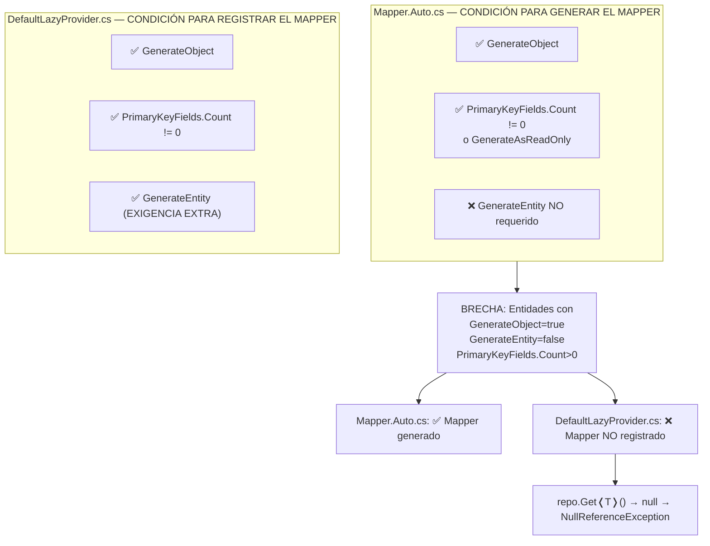
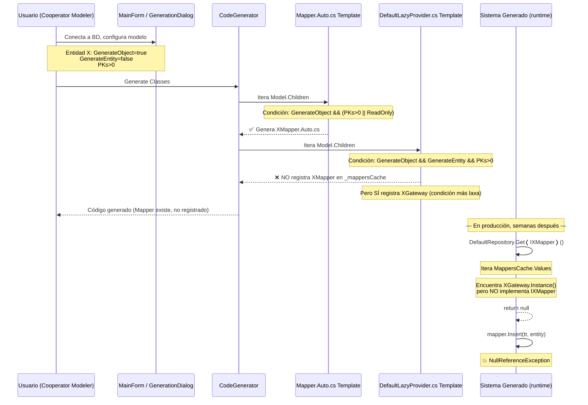

# BUG-001 — Condición asimétrica en DefaultLazyProvider.cs omite Mappers en MappersCache

| Campo          | Valor |
|----------------|-------|
| **Severidad**  | 🔴 Crítica |
| **Detectado en** | Código fuente de CooperatorModeler, raíz del BUG-009 (producción) |
| **Artefactos** | `Templates/CSharpClasses/DefaultLazyProvider.cs`, `Templates/VisualBasicClasses/DefaultLazyProvider.cs`, `Templates/CSharpClasses/Mapper.Auto.cs`, `Templates/VisualBasicClasses/Mapper.Auto.cs` |

## Resumen

El template `DefaultLazyProvider.cs` (y su contraparte VB.NET) utiliza una **condición de decisión asimétrica** respecto al template `Mapper.Auto.cs` para determinar qué entidades merecen tener su Mapper registrado en el diccionario `_mappersCache`. Mientras `Mapper.Auto.cs` genera el archivo `{Entity}Mapper.Auto.cs` para toda entidad que cumpla `GenerateObject && (PrimaryKeyFields.Count != 0 || GenerateAsReadOnly)`, el `DefaultLazyProvider.cs` exige **adicionalmente** que `GenerateEntity == true` y **no contempla** el caso `GenerateAsReadOnly`. Esta asimetría produce Mappers que existen en el código generado pero son inaccesibles a través del repositorio `IMapperRepository.Get<T>()`, provocando `NullReferenceException` en los sistemas que usan el código generado por Cooperator Modeler.

El bug fue descubierto al investigar la causa raíz del **BUG-009** (reportado en producción), donde `RecargoCobradoMapper` existía en disco como archivo `.cs` generado, pero `repo.Get<IRecargoCobradoMapper>()` retornaba `null` porque el Gateway sí estaba en `_mappersCache` pero el Mapper no.

---

## Condiciones para reproducir

### En Cooperator Modeler (generador):

1. Conectarse a una base de datos SQL Server que contenga al menos una tabla con clave primaria.
2. En el TreeView del modelo, **destildar** el checkbox de la entidad (esto pone `GenerateEntity = false`, `GenerateObject` se mantiene `true` si sus propiedades están tildadas — o bien usar el PropertyGrid para setear `GenerateEntity = false` y `GenerateObject = true`).
3. Verificar en el PropertyGrid que `PrimaryKeyFields.Count > 0` (la tabla tiene PK).
4. Generar el código fuente (Stored Procedures + Clases + Solución).
5. Resultado esperado: el `DefaultLazyProvider.cs` generado debe contener una entrada en `_mappersCache` para el Mapper de esa entidad.
6. Resultado real: el `DefaultLazyProvider.cs` generado **NO** contiene la entrada del Mapper para esa entidad, aunque sí contiene la entrada del Gateway.

### En el sistema generado (usuario final, raíz del BUG-009):

1. Tener una entidad `RecargoCobrado` con `GenerateObject = true`, `GenerateEntity = false` (o `true` pero con alguna condición de regeneración que lo dejó fuera del DefaultLazyProvider), y `PrimaryKeyFields.Count > 0`.
2. El código generado incluye `RecargoCobradoMapper.cs` (porque `Mapper.Auto.cs` lo generó correctamente).
3. El código generado incluye `RecargoCobradoGateway.cs` (porque `Gateway.Auto.cs` lo generó correctamente).
4. `DefaultLazyProvider._mappersCache` contiene `RecargoCobradoGateway.Instance()` pero **NO** contiene `RecargoCobradoMapper.Instance()`.
5. En tiempo de ejecución, `DefaultRepository.Get<IRecargoCobradoMapper>()` itera `MappersCache.Values`, no encuentra ninguna instancia que implemente `IRecargoCobradoMapper` (porque el Gateway implementa `IRecargoCobradoGateway`, no `IRecargoCobradoMapper`), y retorna `default(T)` = `null`.
6. Cualquier llamada a método sobre el mapper retornado (ej. `.Insert(tr, entity)`) lanza `System.NullReferenceException`.

### Caso adicional — Entidades ReadOnly sin PKs:

1. Marcar una entidad como `GenerateAsReadOnly = true` con `PrimaryKeyFields.Count == 0`.
2. `Mapper.Auto.cs` **sí** genera el Mapper (la condición incluye `|| GenerateAsReadOnly`).
3. `DefaultLazyProvider.cs` **no** registra el Mapper (la condición solo verifica `PrimaryKeyFields.Count != 0`, sin el `|| GenerateAsReadOnly`).
4. Mismo resultado: Mapper existe pero es inaccesible vía repositorio.

---

## Causa raíz

### Análisis comparativo de condiciones

Recolecté las condiciones de todos los templates relevantes que iteran sobre las entidades del modelo para decidir si generan/registran artefactos:

| Template | Línea | Condición evaluada | Genera/Registra |
|----------|-------|--------------------|-----------------|
| `Object.Auto.cs` | 3 | `GenerateObject && (PrimaryKeyFields.Count != 0 \|\| GenerateAsReadOnly)` | `{Entity}Object.Auto.cs` |
| `Gateway.Auto.cs` | 4 | `GenerateObject && (PrimaryKeyFields.Count != 0 \|\| GenerateAsReadOnly)` | `{Entity}Gateway.Auto.cs` |
| `Entity.Auto.cs` | 4 | `GenerateEntity && GenerateObject && (PrimaryKeyFields.Count != 0 \|\| GenerateAsReadOnly)` | `{Entity}Entity.Auto.cs` |
| **`Mapper.Auto.cs`** | 4 | **`GenerateObject && (PrimaryKeyFields.Count != 0 \|\| GenerateAsReadOnly)`** | **`{Entity}Mapper.Auto.cs`** |
| **`DefaultLazyProvider.cs`** (Mapper) | **54** | **`GenerateObject && GenerateEntity && PrimaryKeyFields.Count != 0`** | **Entrada Mapper en `_mappersCache`** |
| **`DefaultLazyProvider.cs`** (Gateway) | 57 | `GenerateObject && PrimaryKeyFields.Count != 0` | Entrada Gateway en `_mappersCache` |

### Las dos asimetrías

#### Asimetría 1: Exigencia extra de `GenerateEntity` (causa del BUG-009)



`Mapper.Auto.cs` **no** requiere `GenerateEntity = true` para generar el Mapper. Esto es correcto: el Mapper es necesario incluso cuando solo se generan Objects (sin Entities), porque el Mapper contiene la lógica de mapeo `IDataReader → Object` que el Gateway utiliza. Sin embargo, `DefaultLazyProvider.cs` **sí** exige `GenerateEntity = true`, creando una ventana donde el Mapper existe en disco pero es invisible para el repositorio de mappers.

#### Asimetría 2: Omisión de `GenerateAsReadOnly`

`Mapper.Auto.cs` incluye la cláusula `|| GenerateAsReadOnly` para generar Mappers de entidades que no tienen clave primaria pero están marcadas como solo lectura. `DefaultLazyProvider.cs` omite completamente esta cláusula. Si una entidad ReadOnly sin PKs requiere acceso vía repositorio, el Mapper generado por `Mapper.Auto.cs` no estará disponible.

### Evidencia del BUG-009 como instancia concreta

El BUG-009 reporta que en producción, `RecargoCobradoMapper` no está en `_mappersCache`. La entidad `RecargoCobrado`:
- Tiene `GenerateObject = true` (evidencia: el Gateway y el Object existen)
- Tiene `PrimaryKeyFields.Count > 0` (evidencia: la tabla tiene PK `IdRecargoCobrado`)
- Tiene `GenerateEntity = false` **o bien** la condición de `DefaultLazyProvider` falló por la asimetría

Esto calza perfectamente con la Asimetría 1.

### Flujo completo del defecto



---

## Impacto

| Efecto | Descripción | Alcance |
|--------|-------------|---------|
| **Mappers invisibles al repositorio** | Cualquier entidad con `GenerateEntity = false` y `GenerateObject = true` (que tenga PKs) tendrá su Mapper generado pero no registrado en `_mappersCache`. | **Todas las bases de datos** generadas con Cooperator Modeler que contengan entidades en esta configuración. |
| **NullReferenceException en producción** | `DefaultRepository.Get<T>()` retorna `null` para estos Mappers. Cualquier código que use `repo.Get<IMiMapper>()` sin null-check fallará. | Todos los llamadores de `repo.Get<>()` para Mappers de entidades afectadas. |
| **Inconsistencia silenciosa** | El código compila perfectamente (el Mapper existe, su interfaz existe), pero falla en runtime. Los tests unitarios con `TestRepository` no detectan el problema porque usan `repo.Add<T>()` explícito. | Solo detectable en tests de integración o en producción. |
| **Detección tardía** | El BUG-009 es la primera manifestación conocida, pero el defecto existe desde que se introdujo el `DefaultLazyProvider` con `IMapperRepository`. | Acumulativo: cualquier migración futura que cambie `Mapper.Instance()` por `repo.Get<>()` expondrá más instancias. |
| **Entidades ReadOnly sin PKs** | Si existen entidades `GenerateAsReadOnly = true` sin PKs, sus Mappers también son inaccesibles (Asimetría 2). | Menor probabilidad pero mismo mecanismo de falla. |

---

## Propuesta de corrección

### Fix principal: Alinear la condición del DefaultLazyProvider con Mapper.Auto.cs

**Archivos a modificar:**

1. `1.4/Tools/CooperatorModeler/Templates/CSharpClasses/DefaultLazyProvider.cs` — línea 54
2. `1.4/Tools/CooperatorModeler/Templates/VisualBasicClasses/DefaultLazyProvider.cs` — línea 47

**Cambio en C# (línea 54):**

ANTES (condición asimétrica — bug):
```csharp
if (currentEntity.GenerateObject && currentEntity.GenerateEntity && currentEntity.PrimaryKeyFields.Count != 0) {
```

DESPUÉS (condición alineada con Mapper.Auto.cs — fix):
```csharp
if (currentEntity.GenerateObject && (currentEntity.PrimaryKeyFields.Count != 0 || currentEntity.GenerateAsReadOnly)) {
```

**Cambio en VB.NET (línea 47):**

ANTES:
```vb
If currentEntity.GenerateObject AndAlso currentEntity.GenerateEntity AndAlso currentEntity.PrimaryKeyFields.Count <> 0 Then
```

DESPUÉS:
```vb
If currentEntity.GenerateObject AndAlso (currentEntity.PrimaryKeyFields.Count <> 0 OrElse currentEntity.GenerateAsReadOnly) Then
```

### Justificación del fix

La condición `GenerateObject && (PrimaryKeyFields.Count != 0 || GenerateAsReadOnly)` es **idéntica** a la que usan `Mapper.Auto.cs`, `Object.Auto.cs`, y `Gateway.Auto.cs` para decidir si generan sus respectivos archivos. Si esos templates consideran que la entidad merece un Mapper, el `DefaultLazyProvider` debe coincidir.

La eliminación de `GenerateEntity` de la condición es segura porque:
- Si `GenerateEntity = false`, el Mapper igual se genera (Mapper.Auto.cs no lo requiere).
- El Mapper generado en ese caso opera sobre `{Entity}Object` en lugar de `{Entity}` (ver línea 26-27 de Mapper.Auto.cs: `string ObjectWordOrSpace = (currentEntity.GenerateEntity) ? "" : "Object"`).
- El Mapper sigue siendo completamente funcional y necesario para el Gateway.
- El `DefaultRepository.Get<T>()` busca por interfaz (`typeof(T).IsAssignableFrom`), no por tipo concreto, así que funciona correctamente con Mappers que operan sobre Objects.

### Verificación de no regresión

- Entidades con `GenerateEntity = true` y `GenerateObject = true`: el Mapper **seguirá** registrándose (la nueva condición es un superconjunto de la anterior para este caso).
- Entidades con `GenerateObject = false`: no se genera nada, no cambia.
- Entidades sin PKs y sin `GenerateAsReadOnly`: no se genera Mapper, no cambia.
- Entidades `GenerateAsReadOnly` sin PKs: ahora **sí** se registrará el Mapper (antes no), consistente con Mapper.Auto.cs que sí lo genera.

---

## TDD — Estado del ciclo

| Fase | SPEC | Estado |
|------|------|--------|
| Fase 1: Test | — | ⬜ Pendiente |
| Fase 2: Fix  | — | ⬜ Pendiente |

---

## Relaciones

- **Detectado a partir de:** [BUG-009 (input)](../input/BUG-009-NullRef-RecargoCobradoMapper-Cierre-Caja.md) — NullReferenceException en producción por `RecargoCobradoMapper` no registrado en `MappersCache`.
- **BUG-003** — Mismo patrón de causa raíz: mapper no registrado en `MappersCache` (`RepositorioGenericoMapper`).
- **DISC-001** — Análisis exhaustivo del Cooperator Modeler, documenta la arquitectura del sistema de templates.
