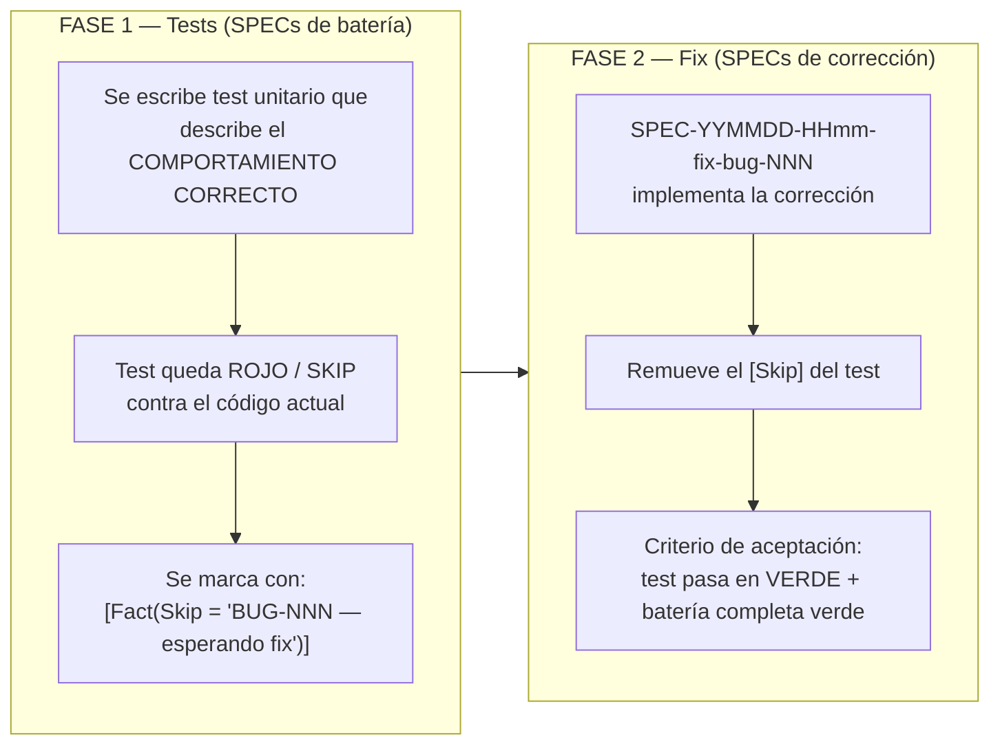
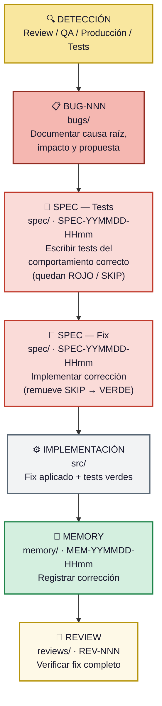

# Bugs (Defectos Confirmados)

## Propósito

Esta carpeta contiene **defectos confirmados** del sistema, documentados con análisis
de causa raíz, impacto y propuesta de corrección. Cada bug es un hallazgo concreto
que requiere intervención de código.

---

## ¿Qué documentos van aquí?

- Defectos confirmados con análisis de causa raíz.
- Bugs identificados durante revisiones de código (extraídos de REVs).
- Problemas reportados por usuarios y confirmados técnicamente.
- Race conditions, errores lógicos, inconsistencias de datos.

---

## Convención de nombres

```
BUG-NNN-descripcion-breve-en-kebab-case.md
```

---

## Estructura recomendada

1. **Título y metadatos** — Número, severidad, fecha, artefactos afectados.
2. **Resumen** — Descripción breve del defecto.
3. **Condiciones para reproducir** — Pasos o escenarios que disparan el bug.
4. **Causa raíz** — Análisis técnico del origen del defecto.
5. **Impacto** — Consecuencias funcionales, contables, de datos.
6. **Propuesta de corrección** — Fix propuesto con pseudocódigo o detalle técnico.
7. **Relaciones** — Referencias a REVs, FAs, o ADRs relacionados.

### Diagramas y Elementos Visuales

Usar **Mermaid** obligatoriamente para todos los diagramas.

---

## Índice de documentos

Ver **[INDEX.md](INDEX.md)** para el listado completo.

---

---

## Ciclo de vida de un BUG

| Estado | Significado |
|--------|-------------|
| **abierto** | Defecto confirmado, pendiente de corrección. |
| **en-progreso** | SPEC de test creada (Skip/Rojo), trabajando en SPEC de fix. |
| **resuelto** | Fix implementado, tests en verde, MEM creada. |
| **cerrado** | Fix verificado en revisión posterior. |

El INDEX.md refleja el estado: ✅ Vigentes (abierto, en-progreso) / ⛔ Resueltos (resuelto, cerrado).

---

## Política de corrección: TDD estricto

Los bugs documentados en esta carpeta se corrigen siguiendo un flujo de **TDD estricto en dos fases**:



### Reglas

1. **Los SPECs de tests NO corrigen bugs.** Solo documentan el comportamiento esperado como código ejecutable.
2. **Cada bug expuesto debe tener al menos un test `[Skip]`** que lo capture. El `Skip` referencia el ID del bug (`BUG-NNN`) y un enlace al review que lo describe.
3. **El SPEC de fix tiene como criterio obligatorio** que el test se reactive (sin `[Skip]`) y pase en verde, junto con toda la batería existente.
4. **No se permite mergear un fix sin tests de regresión.** El test siempre se escribe primero.

> **Nomenclatura:** Tanto los SPECs de tests como los de fix usan la convención
> estándar `SPEC-YYMMDD-HHmm-descripcion.md`. La referencia al BUG se incluye
> en la descripción del nombre (ej. `SPEC-260501-1430-test-bug-001.md`,
> `SPEC-260501-1530-fix-bug-001.md`) y en los metadatos del documento, no como
> un prefijo separado.

---

## Flujo completo de un bug

Desde la detección hasta la resolución:

