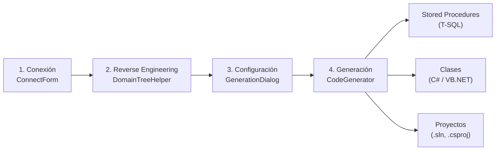
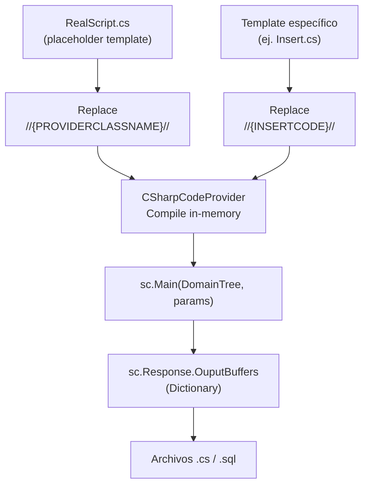
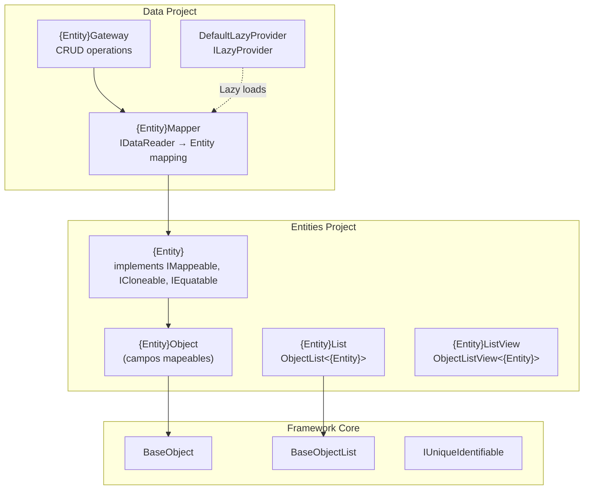

# DISC-001 — Análisis exhaustivo del Cooperator Modeler

| Campo       | Valor |
|-------------|-------|
| **Tipo**    | Discovery — análisis y hallazgos |
| **Fecha**   | 2026-05-09 |
| **Autor**   | Eugenio Serrano |
| **Fuentes** | 24 archivos fuente (.cs), ~90 templates (.cs), 4 proyectos Framework (.csproj) |

---

## 1. Resumen ejecutivo

Cooperator Modeler es una herramienta Windows Forms (.NET Framework 4.8) de **reverse-engineering de base de datos y generación de código**. Fue creada por Eugenio Serrano y Daniel Calvin entre 2006-2007 y está en su versión 1.4.5.0. La herramienta se conecta a una base de datos SQL Server, lee su esquema completo (tablas, columnas, relaciones), construye un modelo en memoria (el `Snapshot`) y genera automáticamente: stored procedures CRUD en T-SQL, clases C# o VB.NET siguiendo el patrón del **Cooperator Framework** (Objects, Entities, Gateways, Mappers, LazyProviders), archivos de proyecto (.csproj/.vbproj), y una solución (.sln) completa lista para compilar. El modelo se persiste en archivos `.Coop` serializados con `BinaryFormatter`.

---

## 2. Inventario / Mapeo

### 2.1 Estructura de archivos del proyecto

| Elemento | Descripción | Notas |
|----------|-------------|-------|
| `Program.cs` | Entry point de la aplicación WinForms | `[STAThread]`, crea `MainForm` y pasa `args` |
| `MainForm.cs` | Formulario principal (589 líneas) | Orquesta toda la UI: conectar, cargar/guardar modelo, generar código |
| `MainForm.Designer.cs` | Diseñador del form principal | TreeView, PropertyGrid, ToolStrip, StatusStrip |
| `Snapshot.cs` | Modelo de datos serializable (273 líneas) | Representa el estado completo del modelo (BD, entidades, configuración) |
| `ConnectForm.cs` | Diálogo de conexión a SQL Server | Descubre servidores de red, lista bases de datos, guarda en registro |
| `GenerationDialog.cs` | Diálogo de generación de código (238 líneas) | Configura nombres de proyectos, SP prefix, lenguaje, carpeta destino |
| `PostGenerationScriptDialog.cs` | Diálogo para script SQL post-generación | Script que se ejecuta y guarda después de los SPs |
| `CodeGenerator.cs` | Motor de generación (578 líneas) | Genera SPs, clases y solución. Coordina los ScriptorProviders |
| `GeneratorRules.cs` | Singleton para ejecución SQL (63 líneas) | Envuelve `BaseRule` del framework para ejecutar comandos contra la BD |
| `FolderHelper.cs` | Utilidades de carpetas (149 líneas) | Crea estructura de carpetas, copia archivos de templates |
| `FileExtensionAssociation.cs` | Registro de extensión .Coop en Windows | Asocia .Coop con el ejecutable en el registro de Windows |
| `UI.cs` | Clase estática de acceso a UI (72 líneas) | Facade para actualizar status bar, progress bar desde cualquier parte |
| `About.cs` | Diálogo About | Muestra info del assembly y licencia |
| `ShowError.cs` | Diálogo de error | Muestra errores con log detallado |
| `Test.cs` | Archivo vacío | Sin contenido |
| `Snapshot.cd` | Diagrama de clases de Visual Studio | Referencia visual del modelo |

### 2.2 Proveedores de Scripting (ScriptorProviders/)

| Elemento | Descripción | Herencia |
|----------|-------------|----------|
| `ScriptorBaseProvider.cs` | Clase base abstracta para todos los scriptors | Extiende `ScriptingClass` del framework |
| `DBBaseScriptor.cs` | Base abstracta para scriptors de BD | Extiende `ScriptorBaseProvider` |
| `SqlServerScriptor.cs` | Implementación concreta para SQL Server (561 líneas) | Extiende `DBBaseScriptor` |
| `OracleScriptor.cs` | Implementación para Oracle (vacía/en progreso) | Extiende `DBBaseScriptor` |
| `ClassesBaseScriptor.cs` | Base abstracta para scriptors de clases | Extiende `ScriptorBaseProvider` |
| `CSharpScriptor.cs` | Implementación concreta para C# (473 líneas) | Extiende `ClassesBaseScriptor` |
| `VisualBasicScriptor.cs` | Implementación para VB.NET | Extiende `ClassesBaseScriptor` |
| `RealScript.cs` | Template para compilación dinámica de scriptors | Contiene placeholders `//{PROVIDERCLASSNAME}//` y `//{INSERTCODE}//` |

### 2.3 Templates de generación

| Carpeta | Contenido |
|---------|-----------|
| `Templates/StoredProcedures/` | 10 templates T-SQL: Insert, Update, Delete, GetAll, GetOne, GetByParent, GetByParents, DeleteByParents, Queries, DescriptionFunction |
| `Templates/CSharpClasses/` | 12 templates C#: Object, Object.Auto, Entity, Entity.Auto, Gateway, Gateway.Auto, Mapper, Mapper.Auto, RuleExample, DefaultLazyProvider |
| `Templates/VisualBasicClasses/` | 10 templates VB.NET: Object, Object.Auto, Entity, Entity.Auto, Gateway, Gateway.Auto, Mapper, Mapper.Auto, RuleExample, DefaultLazyProvider |
| `Templates/ConfigFiles/` | App.config template |
| `Templates/CSharpProjects/` | 8 archivos: .sln, .csproj (App, Entities, Data, Rules), Form1.cs, Form1.Designer.cs, Program.cs |
| `Templates/VisualBasicProjects/` | 7 archivos: .sln, .vbproj (App, Entities, Data, Rules), Form1.vb, Form1.Designer.vb |
| `Templates/Assemblies/` | DLLs del framework: Cooperator.Framework.Core.dll, Cooperator.Framework.Data.dll, Cooperator.Framework.Library.dll |

### 2.4 Proyectos del Framework dependientes

| Proyecto | Rol |
|----------|-----|
| `Cooperator.Framework.Core` | Clases base del ORM: BaseObject, BaseObjectList, IValidable, IUniqueIdentifiable, IRowVersion, LazyLoad, ValuesGenerator, SecurityRights |
| `Cooperator.Framework.Data` | Capa de datos: BaseGateway, BaseRule, SQLHelper, SqlHelperParameterCache, BaseLoader |
| `Cooperator.Framework.Library` | Utilidades: IO (Path, File), Repository (RegistryRepository), Exceptions |
| `Cooperator.Framework.Utility` | Utilidades: DBReverseHelper (DomainTree, Providers/MSSQL), CodeGeneratorHelper (ScriptingHost, ScriptsEnvironment) |

---

## 3. Stack tecnológico

| Aspecto | Tecnología / Versión |
|---------|---------------------|
| **Framework** | .NET Framework 4.8 (originalmente 2.0/3.5) |
| **Lenguaje** | C# 7.x |
| **UI Framework** | Windows Forms (System.Windows.Forms) |
| **Base de datos target** | Microsoft SQL Server (System.Data.SqlClient) |
| **Serialización** | BinaryFormatter (System.Runtime.Serialization.Formatters.Binary) |
| **Compilación dinámica** | CodeDOM (System.CodeDom.Compiler) |
| **Almacenamiento de config** | Registro de Windows (RegistryTarget.CurrentUser) |
| **Base de datos secundaria** | Oracle (System.Data.OracleClient — incompleto) |
| **Lenguajes generados** | C# (CS), VB.NET (VB), T-SQL |
| **Formato de archivo** | `.Coop` (BinaryFormatter serializado) |

---

## 4. Hallazgos detallados

### 4.1 Arquitectura general

La herramienta sigue un flujo de trabajo en 4 fases:



### 4.2 Fase 1: Conexión a la base de datos (`ConnectForm`)

- **Descubrimiento de servidores**: Usa `SqlDataSourceEnumerator.Instance.GetDataSources()` para listar todas las instancias de SQL Server visibles en la red.
- **Listado de bases de datos**: Se conecta a `master` y consulta `GetSchema("Databases")`.
- **Connection string**: Construido con `Integrated Security=SSPI` por defecto.
- **Persistencia**: Servidor y connection string se guardan en `RegistryRepository` (HKCU\Software\Cooperator\Modeler).

### 4.3 Fase 2: Reverse Engineering (`DomainTree`)

- `DomainTreeHelper.GetDomainTree(connectionString, null)` lee TODO el esquema de la BD.
- El resultado es un árbol de nodos `BaseTreeNode`:
  - **Nodo raíz**: `BaseTreeNode` con `Children` siendo los `EntityNode`.
  - **EntityNode**: Representa una tabla. Propiedades: `Name`, `GenerateObject`, `GenerateEntity`, `GenerateAs`, `Namespace`, `PrimaryKeyFields`, `GenerateAsVersionable`, `ToStringInfo`, `DatabaseQueries`.
  - **PropertyNode**: Representa una columna. Propiedades: `Name`, `GenerateProperty`, `IsPrimaryKey`, `IsForeignKey`, `IsIdentity`, `IsNullable`, `IsRowVersion`, `NativeType`, `CLRType`, `RelatedFields`, `RelatedTableName`, `IsCollection`, `IsEntity`, `GenerateAs`, `GenerateAsLazyLoad`.
- Se puede refrescar (`UpdateDomainTree`) para sincronizar con cambios en la BD.
- El `DomainTree` se persiste dentro del `Snapshot` en formato binario.

### 4.4 Fase 3: Configuración del modelo (`GenerationDialog`)

El usuario configura los siguientes parámetros:

| Parámetro | Campo en `Snapshot` | Por defecto |
|-----------|---------------------|-------------|
| SP Prefix | `SPPrefix` | `"Coop_"` |
| Lenguaje | `Language` | `"CS"` o `"VB"` |
| Nombre del proyecto App | `AppProjectName` | Nombre de la BD |
| Nombre del proyecto Data | `DataProjectName` | `"{DBName}Data"` |
| Nombre del proyecto Rules | `RulesProjectName` | `"{DBName}Rules"` |
| Nombre del proyecto Entities | `EntitiesProjectName` | `"{DBName}Entities"` |
| Carpeta de despliegue | `DeployFolder` | (selección manual) |
| Stamp date/time en autos | `StampDateAndTimeOnAutoFiles` | `true` |
| Generar CheckForToken | `GenerateCheckForToken` | `true` |

### 4.5 Fase 4: Generación de código (`CodeGenerator`)

#### 4.5.1 Mecanismo de scripting dinámico

El corazón del generador es un sistema de **compilación dinámica en runtime**:

1. Se lee `RealScript.cs` (template base con placeholders).
2. Se reemplaza `//{PROVIDERCLASSNAME}//` con el nombre del scriptor (ej. `SqlServerScriptor`).
3. Se reemplaza `//{INSERTCODE}//` con el contenido del template específico (ej. `Templates/StoredProcedures/Insert.cs`).
4. El resultado se compila en memoria usando `ScriptingHost` (CodeDOM `CSharpCodeProvider`).
5. Se referencia a los assemblies del propio CooperatorModeler y `System.Windows.Forms`.
6. Se invoca `sc.Main(snapshot.DomainTree, parameters)`.
7. El scriptor devuelve los buffers de salida en `sc.Response.OuputBuffers`.



#### 4.5.2 Jerarquía de Scriptors

```
ScriptorBaseProvider (abstract)
├── DBBaseScriptor (abstract) — métodos para generación T-SQL
│   ├── SqlServerScriptor — implementa sintaxis SQL Server ([dbo].[table], @params, etc.)
│   └── OracleScriptor — incompleto/vacío
└── ClassesBaseScriptor (abstract) — métodos para generación de clases
    ├── CSharpScriptor — implementa sintaxis C#
    └── VisualBasicScriptor — implementa sintaxis VB.NET
```

Cada Scriptor expone métodos abstractos como `PK_AS_PARAMETERS`, `ALL_FIELDS_FOR_SELECT`, `FIELDS_DEFINITION_FOR_OBJECTS`, etc. que son invocados desde los templates usando sintaxis ASP-like (`<% %>`).

#### 4.5.3 Generación de Stored Procedures

Se generan y ejecutan los siguientes SPs por cada tabla marcada:

| Template | SP generado | Propósito |
|----------|-------------|-----------|
| `Insert.cs` | `{Prefix}{Table}_Insert` | INSERT con parámetros + SET IDENTITY + SET ROWVERSION |
| `Update.cs` | `{Prefix}{Table}_Update` | UPDATE con PK anterior (PK_PK_AS_WHERE) |
| `Delete.cs` | `{Prefix}{Table}_Delete` | DELETE por PK + opcional ROWVERSION |
| `GetAll.cs` | `{Prefix}{Table}_GetAll` | SELECT * sin filtro |
| `GetOne.cs` | `{Prefix}{Table}_GetOne` | SELECT * WHERE PK = @PK |
| `GetByParent.cs` | `{Prefix}{Table}_GetBy{Parent}` | SELECT por FK |
| `GetByParents.cs` | `{Prefix}{Table}_GetBy{Parents}` | SELECT por múltiples FKs |
| `DeleteByParents.cs` | `{Prefix}{Table}_DeleteBy{Parents}` | DELETE por FKs |
| `Queries.cs` | `{Prefix}{Table}_{Query}` | SELECTs personalizados definidos en el modelo |
| `DescriptionFunction.cs` | `{Prefix}{Table}_GetDescription` | Función escalar que retorna descripción formateada (opcional) |

Los SPs se ejecutan contra la BD (crean/dropean) y se guardan como archivos `.sql`.

#### 4.5.4 Generación de Clases (patrón Cooperator Framework)

Se generan los siguientes tipos de archivo por cada tabla (Entity marcada como `GenerateObject = true`):

| Archivo | Patrón | Propósito |
|---------|--------|-----------|
| `{Entity}Object.cs` | Manual (no se regenera si existe) | Clase base con propiedades mapeables a BD |
| `{Entity}Object.Auto.cs` | Auto-generado | Campos protegidos `_fieldName`, constructor con parámetros |
| `{Entity}Entity.cs` | Manual | Lógica de negocio, validaciones |
| `{Entity}Entity.Auto.cs` | Auto-generado | Propiedades de agregación (childs, parents), `IMappeable`, `ICloneable`, `IEquatable`, `OriginalValue()` |
| `{Entity}Gateway.cs` | Manual | Métodos de acceso a datos personalizados |
| `{Entity}Gateway.Auto.cs` | Auto-generado | CRUD básico: `Insert`, `Update`, `Delete`, `GetOne`, `GetAll`, `GetBy{FK}`, `GetBy{FKs}` |
| `{Entity}Mapper.cs` | Manual | Lógica de mapeo personalizada |
| `{Entity}Mapper.Auto.cs` | Auto-generado | Mapeo de `IDataReader` a objetos, carga de agregaciones (childs, parents) |
| `{Entity}List` | Auto-generado en Entity.Auto.cs | `ObjectList<{Entity}>` tipada |
| `{Entity}ListView` | Auto-generado en Entity.Auto.cs | `ObjectListView<{Entity}>` para data binding |
| `RuleExample.cs` | Se genera una vez por proyecto | Template de regla de negocio |
| `DefaultLazyProvider.cs` | Auto-generado | Implementación de `ILazyProvider` para lazy loading |
| `App.config` | Auto-generado | Connection string |

#### 4.5.5 Jerarquía de clases generadas



#### 4.5.6 Generación de Proyectos y Solución

1. **CreateSolution**: Crea la estructura de carpetas `{DeployFolder}/{AppProjectName}`, `{DataProjectName}`, `{EntitiesProjectName}`, `{RulesProjectName}`, `CooperatorAssemblies/`. Copia los templates de proyecto (.csproj/.vbproj) reemplazando GUIDs y referencias. Copia los assemblies del framework y el config.

2. **UpdateSolution**: Actualiza solo los archivos `.Auto.*` en una solución existente, preservando los archivos manuales.

3. **QuickGeneration** (toolbar): Hace `GenerateStoredProcedures` + `GenerateClasses` + `UpdateSolution` en un solo paso.

### 4.6 Persistencia del modelo (`.Coop`)

- **Formato**: Serialización binaria con `BinaryFormatter`.
- **Extensión**: `.Coop`, registrada en Windows vía `FileExtensionAssociation`.
- **Contenido**: El objeto `Snapshot` completo: `ConnectionString`, `DataBaseName`, `DomainTree`, `SPPrefix`, nombres de proyectos, `Language`, `DeployFolder`, etc.
- **ModelerVersion**: Al cargar, se verifica y actualiza a `"1.4.5.0"` si es necesario (migración de versiones anteriores).
- **Detección de cambios**: El flag `HaveChanges` se activa cuando cualquier propiedad del `Snapshot` o de cualquier `EntityNode`/`PropertyNode` cambia. Se usa para preguntar si guardar al salir.

### 4.7 UI y experiencia de usuario

- **MainForm**: ToolStrip superior con botones: New (Connect), Load, Save, Refresh, Reconnect, Change Selection, Code Generation, Quick Generation, File Association, About.
- **TreeView**: Muestra el modelo jerárquico (Model → Tablas → Columnas). Los checkboxes permiten seleccionar qué tablas/columnas se generan.
- **PropertyGrid**: Al seleccionar un nodo, muestra sus propiedades editables (GenerateObject, GenerateAs, Namespace, GenerateAsVersionable, etc.).
- **StatusStrip**: Muestra nombre de BD, nombre de archivo, estado y barra de progreso.

### 4.8 Manejo de relaciones entre tablas

El sistema detecta automáticamente relaciones entre tablas y genera:

- **Campos FK**: Si una tabla tiene una FK hacia otra, el `EntityNode` incluye propiedades de navegación (`IsEntity = true`).
- **Colecciones**: Si una tabla es referenciada, la tabla padre tiene una propiedad de colección (`IsCollection = true`).
- **Relaciones 1:1**: Detectadas cuando los campos FK también son PK (`IsOneToOneRelation`).
- **DescriptionField**: Si una propiedad tiene `IsDescriptionField = true`, se genera una función escalar que concatena campos para mostrar una descripción legible.
- **LazyLoading**: Las propiedades de navegación pueden marcarse como `GenerateAsLazyLoad`, lo que difiere la carga hasta el primer acceso.

---

## 5. Brechas y observaciones

| # | Brecha / Observación | Severidad |
|---|---------------------|-----------|
| 1 | **Solo SQL Server funcional**: El `OracleScriptor` está vacío. No hay soporte para otros motores de BD (PostgreSQL, MySQL, SQLite). | 🟡 Media |
| 2 | **BinaryFormatter obsoleto**: `BinaryFormatter` es inseguro y está marcado como obsoleto en .NET 5+. Impide migrar a .NET moderno. | 🔴 Alta |
| 3 | **Soporte solo C# y VB.NET**: No se generan otros lenguajes (TypeScript, Python, Java). | 🟢 Baja |
| 4 | **CodeDOM legacy**: La compilación dinámica con `CSharpCodeProvider` es tecnología legacy. No soporta C# moderno. | 🟡 Media |
| 5 | **UI Windows Forms**: No es multiplataforma. No puede ejecutarse en Linux/macOS sin Mono/Wine. | 🟡 Media |
| 6 | **Sin pruebas automatizadas**: `Test.cs` está vacío. No hay tests unitarios ni de integración. | 🔴 Alta |
| 7 | **Sin manejo de migraciones**: El modelo se refresca leyendo la BD de nuevo, pero no hay un diff formal ni sistema de migraciones. | 🟡 Media |
| 8 | **Solo Integrated Security**: El ConnectForm por defecto usa `Integrated Security=SSPI`. No hay UI para usuario/contraseña SQL Server. | 🟢 Baja |
| 9 | **Templates embebidos en el repo como archivos sueltos**: No hay un sistema de template engine estándar (Razor, Scriban, T4). Los templates son pseudo-ASP con `<% %>`. | 🟡 Media |
| 10 | **Sin documentación de usuario**: No hay manual, help, ni tooltips extensivos. | 🟢 Baja |
| 11 | **Hardcodeo de versión**: `"1.4.5.0"` hardcodeado en `MainForm.cs` y `Snapshot.cs`. | 🟢 Baja |
| 12 | **Sin IoC/DI**: No hay inyección de dependencias. Las dependencias se instancian directamente. | 🟢 Baja |

---

## 6. Recomendaciones

1. **Modernizar la serialización**: Reemplazar `BinaryFormatter` por `System.Text.Json` o `MessagePack` para permitir migración a .NET 8+ y eliminar riesgos de seguridad.
2. **Agregar tests**: Crear una suite de tests unitarios para `CodeGenerator`, `SqlServerScriptor`, `CSharpScriptor` y `DomainTreeHelper`. Usar una BD SQL Server de prueba (o LocalDB) para tests de integración.
3. **Migrar a .NET 8+**: Evaluar la migración de Windows Forms a .NET 8+ (soportado). Evaluar alternativas multiplataforma (Avalonia, MAUI) si se requiere.
4. **Reemplazar CodeDOM**: Migrar el sistema de scripting dinámico a Roslyn (`Microsoft.CodeAnalysis.CSharp.Scripting`) para soportar C# moderno.
5. **Agregar soporte para más DBs**: Implementar `PostgreSqlScriptor` y `MySqlScriptor` completando `DBBaseScriptor`.
6. **Sistema de templates moderno**: Evaluar migrar los templates a Scriban o Razor para mejor mantenibilidad.
7. **Crear ADR**: Documentar la decisión arquitectónica de mantener/evolucionar el Cooperator Modeler vs. reemplazarlo.
8. **Documentar API del framework**: El `DomainTreeHelper`, `PropertyNode`, `EntityNode` y las clases base del framework no tienen documentación. Crear ADRs y specs que documenten el modelo de dominio.

---

## Referencias

- [Cooperator Framework website](http://www.cooperator.com.ar) — mencionado en `About.cs`
- Repositorio: `D:\Cooperator\1.4\Tools\CooperatorModeler\`
- Framework Core: `D:\Cooperator\1.4\Cooperator.Framework.Core\`
- Framework Data: `D:\Cooperator\1.4\Cooperator.Framework.Data\`
- Framework Utility: `D:\Cooperator\1.4\Cooperator.Framework.Utility\`
- Framework Library: `D:\Cooperator\1.4\Cooperator.Framework.Library\`
