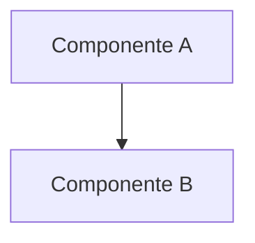

# DISC-NNN — [Título descriptivo]

| Campo       | Valor |
|-------------|-------|
| **Tipo**    | Discovery — análisis y hallazgos |
| **Fecha**   | [YYYY-MM-DD] |
| **Autor**   | [nombre] |
| **Fuentes** | [archivos, sistemas, docs analizados] |

---

## 1. Resumen ejecutivo

[Hallazgo principal o conclusión más relevante en 2-3 frases.]

---

## 2. Inventario / Mapeo

[Listado detallado de lo encontrado: tablas, campos, señales, pines,
módulos, endpoints, etc.]

| Elemento | Descripción | Notas |
|----------|-------------|-------|
|          |             |       |

---

## 3. Stack tecnológico

[Si aplica — tecnologías, versiones, frameworks encontrados.]

| Aspecto | Tecnología / Versión |
|---------|---------------------|
|         |                     |

---

## 4. Hallazgos detallados

[Descripción en profundidad. Usar fragmentos de código, pseudocódigo o
diagramas Mermaid.]

---

## 5. Brechas y observaciones

| # | Brecha / Observación | Severidad |
|---|---------------------|-----------|
| 1 |                     | 🔴 Alta   |
| 2 |                     | 🟡 Media  |
| 3 |                     | 🟢 Baja   |

---

## 6. Recomendaciones

[Próximos pasos, ADRs necesarios, impacto estimado.]

1. [Recomendación 1]
2. [Recomendación 2]

---

## Referencias

- [Fuente 1](url)
- [Fuente 2](url)
