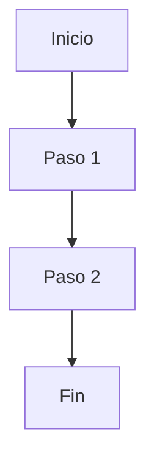

> **Nota sobre el prefijo:** `US-NNN` es una recomendación para trazabilidad.
> No es obligatorio — el equipo puede usar el esquema de nombres que prefiera.

# US-NNN — [Título de la User Story]

| Campo          | Valor |
|----------------|-------|
| **Unit**       | [Unidad funcional / Épica] |
| **ADRs**       | [links a ADRs que aplican] |
| **Estimación** | [Xh AI-time (N Bolts)] |

---

**Como** [rol], **quiero** [acción], **para** [beneficio].

## Criterios de aceptación

- **Given** [contexto], **When** [acción], **Then** [resultado esperado].
- **Given** [contexto], **When** [acción], **Then** [resultado esperado].
- **Given** [contexto], **When** [acción], **Then** [resultado esperado].

## Bolts

| # | Bolt | Capa | Descripción | Timebox |
|---|------|------|-------------|---------|
| 1 | [BOLT-001](US-NNN.BOLT-001-Titulo.md) | Backend | [Descripción] | 2h |
| 2 | [BOLT-002](US-NNN.BOLT-002-Titulo.md) | Frontend | [Descripción] | 3h |

> **Nota:** Los Bolts se detallan en documentos separados usando
> [TEMPLATE-BOLT.md](TEMPLATE-BOLT.md). La organización de archivos
> (subcarpetas por capa, por feature, todo junto, etc.) queda a criterio
> del analista. Cada Bolt tiene su propio DoR, DoD y Demo.

---

## Reglas de negocio

[Restricciones y condiciones del dominio.]

| # | Regla | Condición | Acción |
|---|-------|-----------|--------|
|   |       |           |        |

---

## Flujos de usuario

---

## Impacto

[Módulos afectados, dependencias, riesgos.]

---

## Alineación con herramienta de gestión

[Work Items, Sprint, Board asociados — si aplica sincronización MCP.]
