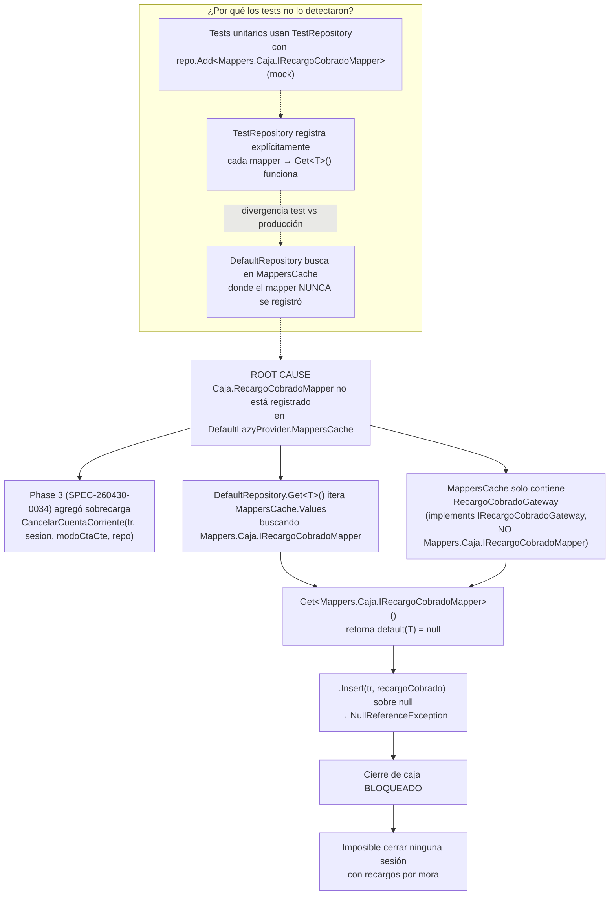

# BUG-009 — NullReferenceException: RecargoCobradoMapper no registrado en MappersCache

| Campo          | Valor |
|----------------|-------|
| **Severidad**  | 🔴 Crítica |
| **Detectado en** | Producción |
| **Artefactos** | `VentasRules/Caja/SesionCajaRule.cs` línea 786, `VentasData/LazyProviders/DefaultLazyProvider.cs` |

## Resumen

Al cerrar una sesión de caja que contiene comprobantes con recargo por mora, el método `CancelarCuentaCorriente` lanza `System.NullReferenceException` en la línea 786 al intentar insertar un `RecargoCobradoObject`. La causa es que `repo.Get<Mappers.Caja.IRecargoCobradoMapper>()` retorna `null` porque `RecargoCobradoMapper` **no está registrado** en `DefaultLazyProvider.MappersCache` — solo el Gateway está registrado.

---

## Condiciones para reproducir

1. Abrir una sesión de caja.
2. Cobrar al menos un comprobante vencido que genere recargo por mora (i.e., `importeRecargo > 0` en `CalcularImporteRecargoParaDetalle`).
3. Cerrar la sesión de caja (`CerrarSesionActual()`).
4. Al procesar `CancelarCuentaCorriente`, el sistema emite la ND de recargo (`EmitirNotaDeDebitoDeRecargos`) exitosamente, pero falla al intentar persistir el `RecargoCobradoObject`.
5. **Resultado:** `System.NullReferenceException` en `SesionCajaRule.CancelarCuentaCorriente`, línea 786.

### Stack trace

```
System.NullReferenceException
  HResult=0x80004003
  Message=Object reference not set to an instance of an object.
  Source=VentasRules
  StackTrace:
   at VentasRules.Caja.SesionCajaRule.CancelarCuentaCorriente(
        DbTransaction tr, SesionCajaObject sesion,
        ModoCuentaCorrienteEnum modoCtaCte, IMapperRepository repo)
        in SesionCajaRule.cs:line 786
```

---

## Causa raíz



### Detalle técnico

**`DefaultLazyProvider.MappersCache`** (línea 540 de `DefaultLazyProvider.cs`):
```csharp
// Solo registra el GATEWAY, no el MAPPER:
DefaultLazyProvider._mappersCache.Add(
    "VentasRules.Objects.Caja.RecargoCobradoObject",
    VentasRules.Gateways.Caja.RecargoCobradoGateway.Instance());
```

**Herencia de clases:**
- `RecargoCobradoGateway` implementa `IRecargoCobradoGateway, IGenericGateway`
- `RecargoCobradoMapper` implementa `Mappers.Caja.IRecargoCobradoMapper, IGenericGateway`
- `IRecargoCobradoGateway ≠ Mappers.Caja.IRecargoCobradoMapper` — son interfaces distintas

**`DefaultRepository.Get<T>()`** busca en `MappersCache.Values` por `typeof(T).IsAssignableFrom(i.GetType())`. Al no encontrar ningún valor que implemente `Mappers.Caja.IRecargoCobradoMapper`, retorna `default(T)` = `null`.

**Contraste:** `ComprobanteCajaDetalleMapper` sí está en `MappersCache` (registrado con su entidad como key en línea 510), por eso `repo.Get<IComprobanteCajaDetalleMapper>()` funciona correctamente en la misma iteración del bucle (línea 687).

### Cadena de llamadas

```mermaid
sequenceDiagram
    participant C as CerrarSesionActual()
    participant CC as CancelarCuentaCorriente(tr, sesion)
    participant CC4 as CancelarCuentaCorriente(tr, sesion, modo, repo)
    participant CALC as CalcularImporteRecargoParaDetalle
    participant ND as EmitirNotaDeDebitoDeRecargos
    participant REPO as DefaultRepository.Get

    C->>CC: (2-param, private)
    CC->>CC4: (4-param) con Repository.GetDefault()
    loop foreach detalle
        CC4->>CALC: d, cuota, repo
        CALC-->>CC4: importeRecargo > 0
        CC4->>ND: Emitir ND (ok)
        ND-->>CC4: recargo (Comprobante)
        Note over CC4: Construye RecargoCobradoObject
        CC4->>REPO: repo.Get&lt;Mappers.Caja.IRecargoCobradoMapper&gt;()
        Note over REPO: Itera MappersCache.Values<br/>No encuentra Caja.IRecargoCobradoMapper
        REPO-->>CC4: null
        Note over CC4: NullReferenceException en línea 786
    end
```

---

## Impacto

| Efecto | Descripción |
|--------|-------------|
| **Cierre de caja bloqueado** | Cualquier sesión de caja con al menos un comprobante vencido que genere recargo > $0 no puede cerrarse |
| **Transacción rollback** | El error se captura en `CerrarSesionActual` (línea 549), se hace rollback de toda la transacción, la sesión queda abierta |
| **Recargos facturados pero no registrados** | La ND de recargo se emite exitosamente (línea 764), pero el `RecargoCobradoObject` no se persiste → inconsistencia si el rollback no revierte la ND en el mismo SP |
| **Operación diaria interrumpida** | Todas las cajas que procesen pagos vencidos quedan imposibilitadas de cerrar |
| **Alcance** | Afecta a **todos** los cierres con recargos por mora |

---

## Propuesta de corrección

### Opción A — Registrar el mapper en `DefaultLazyProvider.MappersCache` (recomendada)

Agregar `RecargoCobradoMapper.Instance()` al diccionario `_mappersCache` en `DefaultLazyProvider.cs`, junto a los demás registros del namespace Caja:

```csharp
// En DefaultLazyProvider.MappersCache, después de línea 540:
DefaultLazyProvider._mappersCache.Add(
    "VentasRules.Entities.Caja.RecargoCobrado",
    VentasRules.Mappers.Caja.RecargoCobradoMapper.Instance());
```

**Ventaja:** Corrige el problema en la raíz. Todos los `repo.Get<Mappers.Caja.IRecargoCobradoMapper>()` funcionarán.
**Riesgo:** Bajo. Es aditivo — no modifica ningún flujo existente.

### Opción B — Fallback a singleton en la línea 786

```csharp
var mapper = repo.Get<Mappers.Caja.IRecargoCobradoMapper>()
    ?? RecargoCobradoMapper.Instance();
mapper.Insert(tr, recargoCobrado);
```

**Ventaja:** Fix localizado.
**Riesgo:** Enmascara el problema subyacente. Otros lugares que usen `repo.Get<Mappers.Caja.IRecargoCobradoMapper>()` seguirían fallando. No aborda el mismo patrón en Recaudación.

### Recomendación

**Opción A** como fix principal. Es consistente con el fix aplicado para BUG-003 (`RepositorioGenericoMapper`). Se debe también verificar si `Mappers.Recaudacion.RecargoCobradoMapper` tiene el mismo problema (no registrado en `_mappersCache`, línea 1260 solo tiene el Gateway).

---

## TDD — Estado del ciclo

| Fase | SPEC | Estado |
|------|------|--------|
| Fase 1: Test | — | ⬜ Pendiente |
| Fase 2: Fix  | — | ⬜ Pendiente |

---

## Relaciones

- **Detectado en:** Producción (reporte directo del usuario)
- **BUG-003** — Mismo patrón de causa raíz: mapper no registrado en `MappersCache` (`RepositorioGenericoMapper`)
- **BUG-008** — Mismo método `CancelarCuentaCorriente`, distinto null (`IdPersonaIntentaCancelar`)
- **SPEC-260430-0034** — Phase 3 que introdujo las sobrecargas inyectables con `IMapperRepository`
- **MEM-260430-0034** — Documentación de la implementación Phase 3
- **ADR-006** — Acceso a mappers vía `IMapperRepository` para testabilidad
- **SPEC-260507-0300** — Refactor que reemplazó `RecargoCobradoMapper.Instance()` por `repo.Get<>()`
