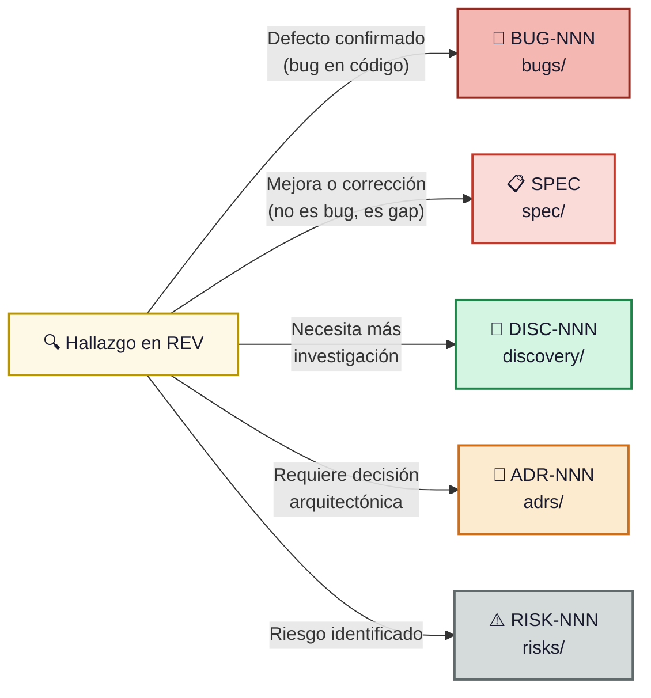

# Reviews (Revisiones Formales)

## Propósito

Esta carpeta contiene **auditorías técnicas formales** del proyecto. Una revisión evalúa
el estado actual del código, la arquitectura y la documentación contra un estándar o
expectativas definidas.

---

## ¿Qué documentos van aquí?

- Análisis de arquitectura.
- Revisiones de código (formales, no de PR).
- Auditorías de seguridad, rendimiento o calidad.
- Revisiones de cumplimiento de estándares.

---

## Convención de nombres

```
REV-NNN-descripcion-breve-en-kebab-case.md
```

---

## Estructura recomendada

1. **Título y metadatos** — Número, nombre, fecha, artefactos revisados.
2. **Artefactos revisados** — Lista de archivos, módulos o sistemas evaluados.
3. **Convenciones verificadas** — Nomenclatura, estructura, patrones.
4. **Hallazgos** — Observaciones categorizadas:
   - ✅ Correcto / Bien
   - ⚠️ Advertencia / Mejora sugerida
   - 🔶 Problema menor
   - 🔴 Problema crítico
5. **Resumen** — Síntesis del estado general.
6. **Plan de acción** — Correcciones necesarias priorizadas.
7. **Conclusiones** — Estado general y recomendación.

### Diagramas y Elementos Visuales

Usar **Mermaid** obligatoriamente para todos los diagramas, gráficos y cualquier otro elemento visual (no ASCII art ni imágenes embebidas).

---

## Índice de documentos

Ver **[INDEX.md](INDEX.md)** para el listado completo.

---

---

## Ciclo de vida de una REV

| Estado | Significado |
|--------|-------------|
| **vigente** | Revisión con hallazgos pendientes de acción. |
| **cerrada** | Todos los hallazgos fueron derivados a BUG, SPEC, DISC, ADR o RISK. No quedan acciones pendientes. |

El INDEX.md refleja el estado: ✅ Vigentes (vigente) / ⛔ Cerradas (cerrada).

---

## ¿Qué hacer con los hallazgos?

Cada hallazgo de una revisión debe canalizarse al artefacto correcto según
su naturaleza. Una review **nunca** corrige nada por sí sola — solo identifica
y clasifica.



### Guía rápida de clasificación

| Tipo de hallazgo | Destino | Ejemplo |
|------------------|---------|---------|
| Bug en runtime o lógica incorrecta | `bugs/` → BUG-NNN | "Thread.Abort() lanza excepción en .NET 5+" |
| Gap de calidad, mejora necesaria | `spec/` → SPEC nueva | "Falta validación en endpoint X" |
| Área desconocida que necesita estudio | `discovery/` → DISC-NNN | "No sabemos cómo se comporta el módulo Y bajo carga" |
| Decisión técnica pendiente | `adrs/` → ADR-NNN | "¿Usamos cache distribuido o local?" |
| Amenaza al proyecto | `risks/` → RISK-NNN | "Dependencia de API sin SLA definido" |
| Todo bien, cumple estándares | ✅ Se documenta en la REV, no genera acción |
